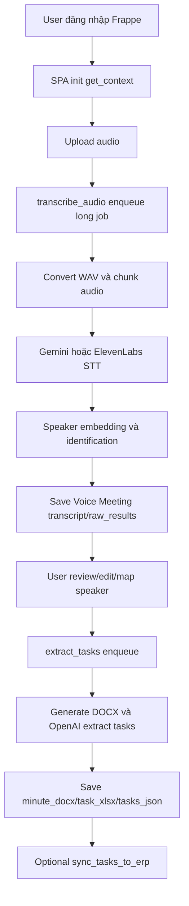
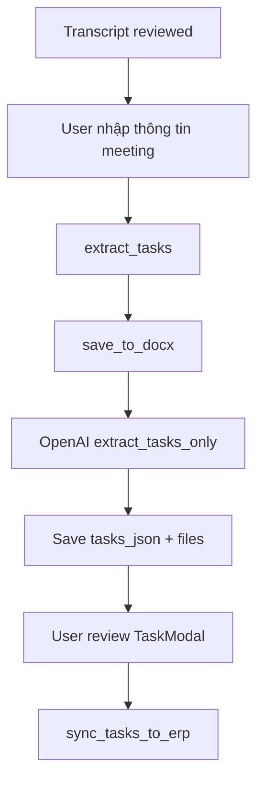
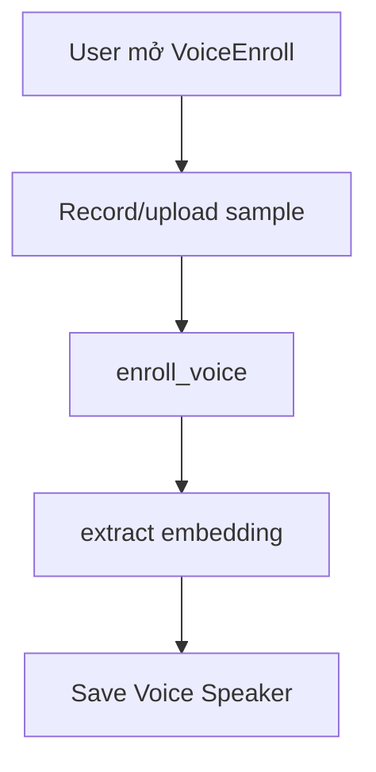

## Mục Đích

Tài liệu hóa business process cho dự án dựa trên source code hiện tại.

## Phạm Vi

Phạm vi bám theo app `voice_app`, frontend `frontend/src`, DocType schema và các tích hợp trong source.

## Đối Tượng Sử Dụng

Các vai trò dự án liên quan: PM/BA/Dev/QA/DevOps/Security/Ops.

## Nội Dung Chi Tiết

### Quy trình 1: Phân tích hội thoại

| Mục | Nội dung |
|---|---|
| Trigger | User upload audio trên màn hình `VoiceTranscribe.vue`. |
| Actor | Authenticated Frappe user. |
| Input | Audio file, STT mode, filter_speakers, vocabulary. |
| Output | Transcript, raw segments, speaker labels, meeting history. |
| Exception | Missing file, STT error, chunk error, permission error. |
| Audit event | Realtime progress, `VOICE Action Log` khi có session logging. |

### Quy trình 2: Tạo task từ biên bản

### Quy trình 3: Đăng ký giọng nói

## Giả Định

- ASSUMPTION: Dự án được triển khai như một Frappe app trong Frappe Bench v15+ theo README hiện tại.
- ASSUMPTION: Các URL môi trường ngoài local cần được đội vận hành xác nhận.

## Vấn Đề Cần Xác Nhận

- TODO: Cần xác nhận owner tài liệu, người phê duyệt, SLA/SLO, RTO/RPO và môi trường production chính thức.
- NOT FOUND: Không tìm thấy CI/CD workflow, Dockerfile, Kubernetes manifest hoặc `.env.example` trong workspace hiện tại.

## Tài Liệu Liên Quan

- [Project Discovery](../00-PROJECT-DISCOVERY.md)
- [Document Map](../DOCUMENT-MAP.md)
- [API Specification](../05. KỸ THUẬT, BẢO MẬT & AI/03-API-SPECIFICATION.md)
- [Requirement Traceability Matrix](../02. NGHIỆP VỤ & YÊU CẦU/09-REQUIREMENT-TRACEABILITY-MATRIX.md)

## Lịch Sử Thay Đổi

| Ngày | Phiên bản | Thay đổi | Tác giả |
|---|---:|---|---|
| 2026-07-28 | 0.1 | AI bổ sung tài liệu ban đầu từ source code. | Codex |

