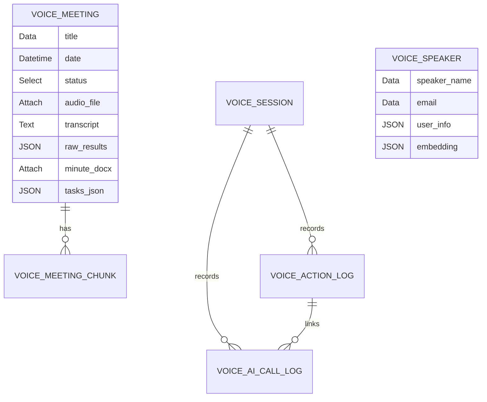

## Mục Đích

Tài liệu hóa database design cho dự án dựa trên source code hiện tại.

## Phạm Vi

Phạm vi bám theo app `voice_app`, frontend `frontend/src`, DocType schema và các tích hợp trong source.

## Đối Tượng Sử Dụng

Các vai trò dự án liên quan: PM/BA/Dev/QA/DevOps/Security/Ops.

## Nội Dung Chi Tiết

### ERD

### Entities

| Entity | Key fields | Status values | Source |
|---|---|---|---|
| Voice Meeting | title, date, status, audio_file, transcript, raw_results, minute_docx, task_xlsx, tasks_json | Pending, Processing, Completed, Error, Analyzed, Synced | `voice_meeting.json` |
| Voice Meeting Chunk | meeting, chunk_index, status, offset_sec, audio_file_path, raw_segments | Pending, Processing, Completed, Error | `voice_meeting_chunk.json` |
| Voice Speaker | speaker_name, email, user_info, embedding | N/A | `voice_speaker.json` |
| Voice App Settings | API/config fields | Singleton | `voice_app_settings.json` |
| VOICE Session/Action/AI Call Log | session/action/call metadata, tokens | active/completed, success/failed/etc. | `voice_session.json`, `voice_action_log.json`, `voice_ai_call_log.json` |

Soft delete/audit fields: Frappe standard fields apply implicitly. Partitioning/retention: NOT FOUND.

## Giả Định

- ASSUMPTION: Dự án được triển khai như một Frappe app trong Frappe Bench v15+ theo README hiện tại.
- ASSUMPTION: Các URL môi trường ngoài local cần được đội vận hành xác nhận.

## Vấn Đề Cần Xác Nhận

- TODO: Cần xác nhận owner tài liệu, người phê duyệt, SLA/SLO, RTO/RPO và môi trường production chính thức.
- NOT FOUND: Không tìm thấy CI/CD workflow, Dockerfile, Kubernetes manifest hoặc `.env.example` trong workspace hiện tại.

## Tài Liệu Liên Quan

- [Project Discovery](../00-PROJECT-DISCOVERY.md)
- [Document Map](../DOCUMENT-MAP.md)
- [API Specification](../05. KỸ THUẬT, BẢO MẬT & AI/03-API-SPECIFICATION.md)
- [Requirement Traceability Matrix](../02. NGHIỆP VỤ & YÊU CẦU/09-REQUIREMENT-TRACEABILITY-MATRIX.md)

## Lịch Sử Thay Đổi

| Ngày | Phiên bản | Thay đổi | Tác giả |
|---|---:|---|---|
| 2026-07-28 | 0.1 | AI bổ sung tài liệu ban đầu từ source code. | Codex |

