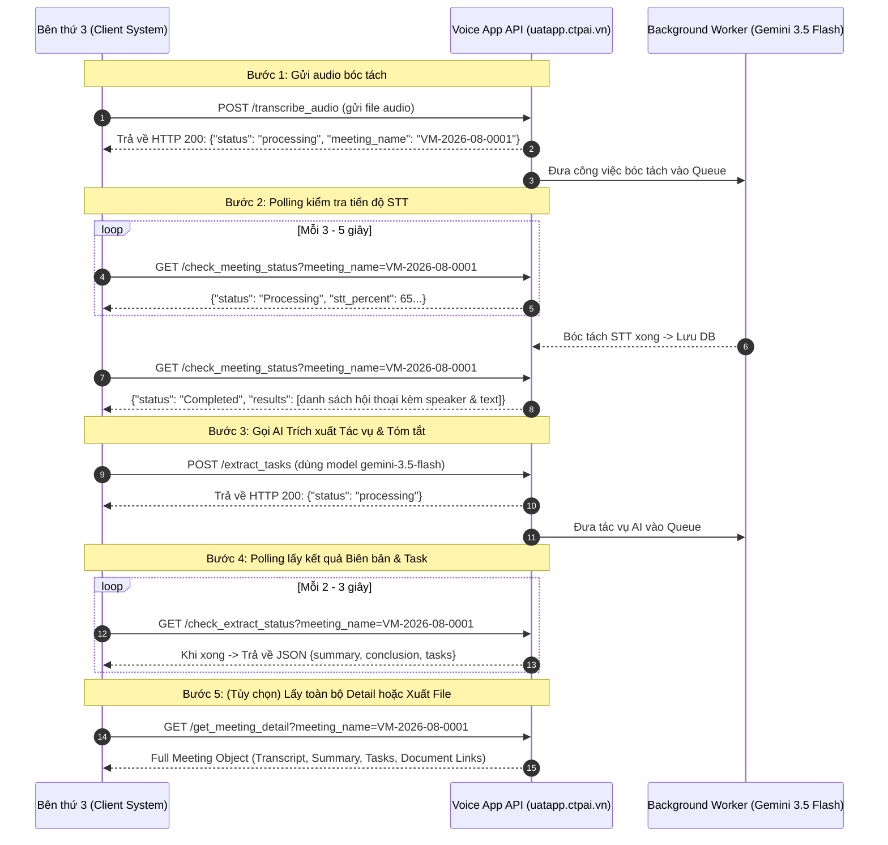

# TÀI LIỆU HƯỚNG DẪN TÍCH HỢP API (VOICE APP) DÀNH CHO BÊN THỨ 3 (THIRD-PARTY API DOCUMENTATION)

Document này mô tả chi tiết danh sách các API endpoint của hệ thống **Voice App** (phát triển trên nền tảng Frappe Framework) phục vụ việc nhận dạng giọng nói, bóc tách hội thoại (Speech-to-Text), phân nhận dạng người nói (Speaker Diarization), trích xuất công việc/biên bản họp bằng AI (AI Task Extraction & Meeting Minutes), và đồng bộ dữ liệu với hệ thống ERP / Worksuite.

Mọi API dưới đây đều được cấu hình sẵn domain **`https://uatapp.ctpai.vn`** và model AI mặc định **`gemini-3.5-flash`** kèm mẫu câu lệnh **cURL** đầy đủ với Header xác thực Token:
`-H "Authorization: token <API_KEY>:<API_SECRET>"`

---

## 1. TỔNG QUAN & XÁC THỰC (AUTHENTICATION)

### 1.1 Base URL
- **Base Endpoint URL**: `https://uatapp.ctpai.vn/api/method/`

### 1.2 Phương thức Xác thực (Token Authentication)
Bên thứ 3 (Server-to-Server) sử dụng cặp `API_KEY` và `API_SECRET` được cấp từ hệ thống Frappe, truyền vào HTTP Header `Authorization`:

```http
Authorization: token <API_KEY>:<API_SECRET>
```
*Ví dụ:* `Authorization: token a1b2c3d4e5f6:7g8h9i0j1k2l`

---

## 2. HUỚNG DẪN LUỒNG XỬ LÝ BẤT ĐỒNG BỘ & LẤY KẾT QUẢ RESPONSE (ASYNC WORKFLOW)

Do việc bóc tách audio và chạy mô hình AI (Gemini 3.5 Flash) mất nhiều thời gian tùy độ dài file audio, các API nặng (`transcribe_audio`, `extract_tasks`) hoạt động theo chế độ **Xử lý Bất đồng bộ (Async Queue)**.

### Sơ đồ Luồng tích hợp cho Bên thứ 3:



---

## 3. QUY CHUẨN ĐỊNH DẠNG DỮ LIỆU (RESPONSE FORMAT)

### 3.1 Thành công (Success Response)
```json
{
  "message": {
    "status": "success",
    "data": { ... }
  }
}
```

### 3.2 Thất bại / Lỗi (Error Response)
```json
{
  "message": {
    "status": "error",
    "message": "Mô tả chi tiết nguyên nhân lỗi"
  }
}
```

---

## 4. DANH SÁCH TẤT CẢ CÁC LỆNH cURL CHUẨN DOMAIN `https://uatapp.ctpai.vn`

---

### GROUP 1: NHẬN DẠNG GIỌNG NÓI & QUẢN LÝ CUỘC HỌP (SPEECH-TO-TEXT & MEETING)

#### 1.1 Tải lên File Âm thanh & Khởi chạy Bóc tách (Transcribe Audio)
- **Endpoint**: `POST https://uatapp.ctpai.vn/api/method/voice_app.api.transcribe_audio`
- **Content-Type**: `multipart/form-data`
- **Lưu ý**: Chế độ STT tự động dùng **Google Gemini**, hệ thống tự động nhận dạng phân biệt số lượng người nói.

**Form Data Parameters:**
| Tham số | Kiểu dữ liệu | Bắt buộc | Mô tả |
| :--- | :--- | :--- | :--- |
| `file` | File Binary | **Có** | File âm thanh cuộc họp (.wav, .mp3, .m4a, .ogg...) |
| `language` | String | Không | Ngôn ngữ bóc tách (Mặc định: `"vi"`) |
| `filter_speakers` | JSON String Array | Không | Danh sách nhân viên tham gia họp để ưu tiên khớp giọng trong DB. VD: `["Nguyễn Văn A", "Trần Thị B"]` |
| `custom_vocabulary` | String | Không | Từ vựng riêng/Thuật ngữ chuyên ngành |

**cURL Command (Gọn nhẹ chuẩn):**
```bash
curl -X POST "https://uatapp.ctpai.vn/api/method/voice_app.api.transcribe_audio" \
  -H "Authorization: token <API_KEY>:<API_SECRET>" \
  -F "file=@/path/to/audio_record.wav" \
  -F "language=vi" \
  -F "filter_speakers=[\"Nguyễn Văn A\", \"Trần Thị B\"]" \
  -F "custom_vocabulary=Worksuite, Frappe, AI"
```

**Response Ngay Lập Tức (Immediate Response):**
```json
{
  "message": {
    "status": "processing",
    "meeting_name": "VM-2026-08-0001",
    "message": "Đã nhận file âm thanh và đang xử lý bất đồng bộ."
  }
}
```

---

#### 1.2 Kiểm tra Tiến độ Xử lý Cuộc họp & Lấy Kết quả STT (Check Meeting Status)
- **Endpoint**: `GET https://uatapp.ctpai.vn/api/method/voice_app.api.check_meeting_status`

**cURL Command:**
```bash
curl -X GET "https://uatapp.ctpai.vn/api/method/voice_app.api.check_meeting_status?meeting_name=VM-2026-08-0001" \
  -H "Authorization: token <API_KEY>:<API_SECRET>"
```

**Response khi đang xử lý (Status = Processing):**
```json
{
  "message": {
    "status": "Processing",
    "stt_percent": 65,
    "stt_msg": "Đang bóc tách văn bản 65%...",
    "spk_percent": 30,
    "spk_msg": "Đang phân biệt người nói..."
  }
}
```

**Response KẾT QUẢ HOÀN TẤT (Status = Completed):**
```json
{
  "message": {
    "status": "Completed",
    "stt_percent": 100,
    "spk_percent": 100,
    "results": [
      {
        "start": 0.0,
        "end": 4.5,
        "speaker": "Nguyễn Văn A",
        "text": "Xin chào tất cả mọi người, chúng ta bắt đầu cuộc họp."
      },
      {
        "start": 4.8,
        "end": 9.2,
        "speaker": "Trần Thị B",
        "text": "Báo cáo tiến độ dự án tuần này đã đạt 90% kế hoạch."
      }
    ]
  }
}
```

---

#### 1.3 Lấy Lịch sử Cuộc họp (Get Meeting History)
- **Endpoint**: `GET https://uatapp.ctpai.vn/api/method/voice_app.api.get_meeting_history`

**cURL Command:**
```bash
curl -X GET "https://uatapp.ctpai.vn/api/method/voice_app.api.get_meeting_history" \
  -H "Authorization: token <API_KEY>:<API_SECRET>"
```

---

#### 1.4 Lấy Chi tiết Đầy đủ Một Cuộc họp (Get Meeting Detail)
- **Endpoint**: `GET https://uatapp.ctpai.vn/api/method/voice_app.api.get_meeting_detail`

**cURL Command:**
```bash
curl -X GET "https://uatapp.ctpai.vn/api/method/voice_app.api.get_meeting_detail?meeting_name=VM-2026-08-0001" \
  -H "Authorization: token <API_KEY>:<API_SECRET>"
```

**Response KẾT QUẢ ĐẦY ĐỦ (Full Meeting Detail Response):**
```json
{
  "message": {
    "status": "success",
    "meeting": {
      "name": "VM-2026-08-0001",
      "title": "Họp Giao Ban Tuần 32",
      "date": "2026-08-07 09:00:00",
      "status": "Completed",
      "transcript": "Nguyễn Văn A: Xin chào tất cả mọi người...\nTrần Thị B: Báo cáo tiến độ...",
      "meeting_summary": "Tóm tắt: Cuộc họp thảo luận về tiến độ dự án và phân công nhiệm vụ mới...",
      "conclusion": "Kết luận: Thống nhất chốt kế hoạch phát hành trước 20/08.",
      "tasks_json": "[{\"task_name\": \"Hoàn thiện API doc\", \"assignee\": \"nguyenvana@ctgroup.vn\", \"deadline\": \"2026-08-15\"}]",
      "minute_docx": "/files/VM-2026-08-0001_Minute.docx",
      "task_xlsx": "/files/VM-2026-08-0001_Tasks.xlsx"
    }
  }
}
```

---

#### 1.5 Đổi tên Cuộc họp (Rename Meeting)
- **Endpoint**: `POST https://uatapp.ctpai.vn/api/method/voice_app.meeting_api.rename_meeting`
- **Content-Type**: `application/json`

**cURL Command:**
```bash
curl -X POST "https://uatapp.ctpai.vn/api/method/voice_app.meeting_api.rename_meeting" \
  -H "Authorization: token <API_KEY>:<API_SECRET>" \
  -H "Content-Type: application/json" \
  -d '{
    "meeting_name": "VM-2026-08-0001",
    "new_title": "Họp Triển Khai Kế Hoạch Q3"
  }'
```

---

#### 1.6 Chạy lại Cuộc họp bị Lỗi (Resume Transcription)
- **Endpoint**: `POST https://uatapp.ctpai.vn/api/method/voice_app.api.resume_transcription`
- **Content-Type**: `application/json`

**cURL Command:**
```bash
curl -X POST "https://uatapp.ctpai.vn/api/method/voice_app.api.resume_transcription" \
  -H "Authorization: token <API_KEY>:<API_SECRET>" \
  -H "Content-Type: application/json" \
  -d '{
    "meeting_name": "VM-2026-08-0001"
  }'
```

---

### GROUP 2: TÓM TẮT & TRÍCH XUẤT TÁC VỤ AI (AI TASK EXTRACTION)

#### 2.1 Trích xuất Biên bản & Tác vụ tự động bằng AI (Extract Tasks)
- **Endpoint**: `POST https://uatapp.ctpai.vn/api/method/voice_app.api.extract_tasks`
- **Content-Type**: `application/json`
- **Model mặc định**: `gemini-3.5-flash`

**cURL Command:**
```bash
curl -X POST "https://uatapp.ctpai.vn/api/method/voice_app.api.extract_tasks" \
  -H "Authorization: token <API_KEY>:<API_SECRET>" \
  -H "Content-Type: application/json" \
  -d '{
    "meeting_name": "VM-2026-08-0001",
    "results": [
      {
        "start": 0.0,
        "end": 10.5,
        "speaker": "Nguyễn Văn A",
        "text": "Nhiệm vụ của anh B là hoàn thành báo cáo trước ngày 15/8."
      }
    ],
    "model_type": "gemini-3.5-flash",
    "start_time": "2026-08-07 09:00",
    "end_time": "2026-08-07 10:00",
    "location": "Phòng họp 301",
    "chairperson": "Nguyễn Văn A"
  }'
```

**Response Ngay Lập Tức:**
```json
{
  "message": {
    "status": "processing"
  }
}
```

---

#### 2.2 Kiểm tra Trạng thái & Lấy Kết quả Trích xuất Tác vụ (Check Extract Status)
- **Endpoint**: `GET https://uatapp.ctpai.vn/api/method/voice_app.api.check_extract_status`

**cURL Command:**
```bash
curl -X GET "https://uatapp.ctpai.vn/api/method/voice_app.api.check_extract_status?meeting_name=VM-2026-08-0001" \
  -H "Authorization: token <API_KEY>:<API_SECRET>"
```

**Response khi chưa xong:**
```json
{
  "message": {
    "status": "processing"
  }
}
```

**Response KẾT QUẢ TÓM TẮT & TASKS (Status = success):**
```json
{
  "message": {
    "status": "success",
    "summary": "Cuộc họp thảo luận tiến độ xây dựng API và chuẩn bị tài liệu cho đối tác...",
    "conclusion": "Thống nhất bàn giao tài liệu API trước ngày 15/08/2026.",
    "tasks": [
      {
        "task_name": "Hoàn thiện tài liệu cURL API",
        "assignee": "Trần Thị B",
        "deadline": "2026-08-15",
        "priority": "High",
        "description": "Cung cấp đầy đủ cURL mẫu cho bên thứ 3 tích hợp."
      }
    ]
  }
}
```

---

#### 2.3 Lưu Bản nháp Nội dung Cuộc họp (Save Meeting Draft)
- **Endpoint**: `POST https://uatapp.ctpai.vn/api/method/voice_app.api.save_meeting_draft`
- **Content-Type**: `application/json`

**cURL Command:**
```bash
curl -X POST "https://uatapp.ctpai.vn/api/method/voice_app.api.save_meeting_draft" \
  -H "Authorization: token <API_KEY>:<API_SECRET>" \
  -H "Content-Type: application/json" \
  -d '{
    "meeting_name": "VM-2026-08-0001",
    "summary": "Nội dung tóm tắt đã chỉnh sửa...",
    "conclusion": "Kết luận đã bổ sung...",
    "tasks_json_str": "[{\"task_name\": \"Hoàn thành báo cáo\", \"assignee\": \"Trần Thị B\"}]"
  }'
```

---

#### 2.4 Bóc tách Tác vụ Nhanh từ Giọng nói (Voice to Task Direct)
- **Endpoint**: `POST https://uatapp.ctpai.vn/api/method/voice_app.api.voice_to_task`
- **Content-Type**: `multipart/form-data`

**cURL Command:**
```bash
curl -X POST "https://uatapp.ctpai.vn/api/method/voice_app.api.voice_to_task" \
  -H "Authorization: token <API_KEY>:<API_SECRET>" \
  -F "file=@/path/to/voice_command.wav" \
  -F "job_key=v2t_job_123"
```

---

### GROUP 3: QUẢN LÝ NGƯỜI NÓI & NHẬN DẠNG GIỌNG (SPEAKER MANAGEMENT)

#### 3.1 Đăng ký Mẫu giọng nói Tài khoản (Enroll Voice)
- **Endpoint**: `POST https://uatapp.ctpai.vn/api/method/voice_app.api.enroll_voice`
- **Content-Type**: `multipart/form-data`

**cURL Command:**
```bash
curl -X POST "https://uatapp.ctpai.vn/api/method/voice_app.api.enroll_voice" \
  -H "Authorization: token <API_KEY>:<API_SECRET>" \
  -F "file=@/path/to/voice_sample.wav"
```

---

#### 3.2 Lấy Danh sách Người đã Đăng ký Giọng (Get Enrolled Speakers)
- **Endpoint**: `GET https://uatapp.ctpai.vn/api/method/voice_app.api.get_enrolled_speakers`

**cURL Command:**
```bash
curl -X GET "https://uatapp.ctpai.vn/api/method/voice_app.api.get_enrolled_speakers" \
  -H "Authorization: token <API_KEY>:<API_SECRET>"
```

---

#### 3.3 Ánh xạ Nhãn Người lạ & Quét lại Cuộc họp (Map & Enroll Speakers)
- **Endpoint**: `POST https://uatapp.ctpai.vn/api/method/voice_app.api.map_and_enroll_speakers`
- **Content-Type**: `application/json`

**cURL Command:**
```bash
curl -X POST "https://uatapp.ctpai.vn/api/method/voice_app.api.map_and_enroll_speakers" \
  -H "Authorization: token <API_KEY>:<API_SECRET>" \
  -H "Content-Type: application/json" \
  -d '{
    "meeting_name": "VM-2026-08-0001",
    "mappings": {
      "Người lạ 1": "Nguyễn Văn A",
      "Người lạ 2": "Trần Thị B"
    }
  }'
```

---

#### 3.4 Học giọng từ 1 Đoạn Hội thoại Cụ thể (Enroll Speaker From Segment)
- **Endpoint**: `POST https://uatapp.ctpai.vn/api/method/voice_app.api.enroll_speaker_from_segment`
- **Content-Type**: `application/json`

**cURL Command:**
```bash
curl -X POST "https://uatapp.ctpai.vn/api/method/voice_app.api.enroll_speaker_from_segment" \
  -H "Authorization: token <API_KEY>:<API_SECRET>" \
  -H "Content-Type: application/json" \
  -d '{
    "meeting_name": "VM-2026-08-0001",
    "segment_index": 3,
    "new_speaker_name": "Lê Văn C"
  }'
```

---

#### 3.5 Gán lại Người nói cho Đoạn & Quét lại (Reassign Speaker From Segment)
- **Endpoint**: `POST https://uatapp.ctpai.vn/api/method/voice_app.api.reassign_speaker_from_segment`
- **Content-Type**: `application/json`

**cURL Command:**
```bash
curl -X POST "https://uatapp.ctpai.vn/api/method/voice_app.api.reassign_speaker_from_segment" \
  -H "Authorization: token <API_KEY>:<API_SECRET>" \
  -H "Content-Type: application/json" \
  -d '{
    "meeting_name": "VM-2026-08-0001",
    "segment_index": 2,
    "new_speaker_name": "Phạm Văn D"
  }'
```

---

### GROUP 4: TÍCH HỢP ERP & XUẤT TÀI LIỆU (ERP SYNC & EXPORT)

#### 4.1 Đồng bộ Tác vụ sang Hệ thống ERP / Worksuite (Sync Tasks to ERP)
- **Endpoint**: `POST https://uatapp.ctpai.vn/api/method/voice_app.api.sync_tasks_to_erp`
- **Content-Type**: `application/json`

**cURL Command:**
```bash
curl -X POST "https://uatapp.ctpai.vn/api/method/voice_app.api.sync_tasks_to_erp" \
  -H "Authorization: token <API_KEY>:<API_SECRET>" \
  -H "Content-Type: application/json" \
  -d '{
    "tasks": [
      {
        "task_name": "Thiết kế giao diện API",
        "assignee": "nguyenvana@ctgroup.vn",
        "deadline": "2026-08-20",
        "priority": "High",
        "description": "Yêu cầu viết tài liệu Swagger/Markdown cho bên thứ 3."
      }
    ]
  }'
```

---

#### 4.2 Xuất File Biên bản Họp Word (.docx) (Export Dynamic DOCX)
- **Endpoint**: `POST https://uatapp.ctpai.vn/api/method/voice_app.api.export_dynamic_docx`
- **Content-Type**: `application/json`

**cURL Command:**
```bash
curl -X POST "https://uatapp.ctpai.vn/api/method/voice_app.api.export_dynamic_docx" \
  -H "Authorization: token <API_KEY>:<API_SECRET>" \
  -H "Content-Type: application/json" \
  -d '{
    "meeting_name": "VM-2026-08-0001"
  }'
```

---

#### 4.3 Tải Trực tiếp File Cuộc họp (.docx / .xlsx) (Download Meeting File)
- **Endpoint**: `GET https://uatapp.ctpai.vn/api/method/voice_app.api.download_meeting_file`

**cURL Command:**
```bash
curl -X GET "https://uatapp.ctpai.vn/api/method/voice_app.api.download_meeting_file?meeting_name=VM-2026-08-0001&file_type=docx" \
  -H "Authorization: token <API_KEY>:<API_SECRET>" \
  --output "VM-2026-08-0001_Minute.docx"
```

---

#### 4.4 Lấy Danh sách Nhân viên Đồng bộ (Get Employees)
- **Endpoint**: `GET https://uatapp.ctpai.vn/api/method/voice_app.api.get_employees`

**cURL Command:**
```bash
curl -X GET "https://uatapp.ctpai.vn/api/method/voice_app.api.get_employees" \
  -H "Authorization: token <API_KEY>:<API_SECRET>"
```

---
*Tài liệu được tinh chỉnh tối giản cURL transcribe_audio dựa theo nguồn code thực tế.*
