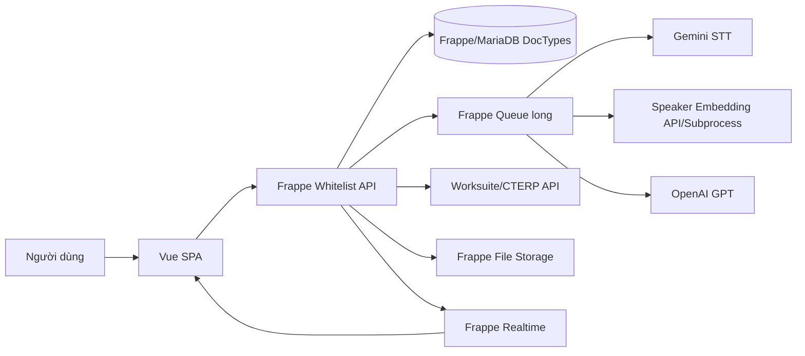

# Tài Liệu Hệ Thống

## 1. Tổng Quan

`voice_app` là một Frappe app có giao diện Vue SPA, dùng để xử lý âm thanh cuộc họp, chuyển giọng nói thành văn bản, nhận diện người nói, xuất biên bản họp, trích xuất task bằng AI và đồng bộ task sang Worksuite/CTERP.

Tên thương mại trong source là `2AS Worksuite`. Tên package/app là `voice_app`.

Tài liệu này được viết sau khi rà soát các nguồn chính:

- `README.md`
- `pyproject.toml`
- `voice_app/hooks.py`
- `voice_app/api.py`
- `voice_app/meeting_api.py`
- `voice_app/gemini_stt_client.py`
- `voice_app/speaker_manager.py`
- `voice_app/task_extractor.py`
- `voice_app/audio_utils.py`
- `voice_app/utils/activity_logger.py`
- `voice_app/voice_app/doctype/*/*.json`
- `frontend/src/*`

## 2. Công Nghệ

| Nhóm | Công nghệ phát hiện | Ghi chú |
|---|---|---|
| Backend | Python 3.10+, Frappe Framework | Frappe whitelist API, DocType, queue, cache, realtime. |
| Frontend | Vue 3, Vite, Element Plus, Tailwind CSS | SPA đặt tại `frontend/src`. |
| Database | MariaDB qua Frappe DocType | Schema nằm trong `voice_app/voice_app/doctype`. |
| Queue | Frappe background jobs | `frappe.enqueue(..., queue="long")` cho transcription/task extraction. |
| Realtime | Frappe realtime/socket | `frappe.publish_realtime()` cho progress STT và voice-to-task. |
| STT | Google Gemini Files API/generateContent | Luồng thực tế đang ép `stt_mode = "google"`. |
| Legacy STT | ElevenLabs | Code client còn tồn tại, nhưng endpoint trả thông báo đã tắt ElevenLabs STT. |
| Speaker embedding | Local/remote Pyannote embedding | `speaker_manager.py`, `extract_embedding.py`, remote `embedding_api_url`. |
| LLM task extraction | OpenAI GPT-4o/GPT-4o-mini | `task_extractor.py` và `voice_to_task`. |
| File processing | ffmpeg, pydub, webrtcvad, python-docx, openpyxl/pandas | Convert/chunk audio, xuất DOCX/XLSX. |
| External ERP | Worksuite/CTERP Frappe API | Lấy nhân sự/dự án và tạo task. |

NOT FOUND: Không tìm thấy Dockerfile, docker-compose, Kubernetes manifest, Helm chart, CI/CD workflow hoặc `.env.example` trong workspace hiện tại.

## 3. Kiến Trúc Tổng Thể



### Thành phần chính

| Thành phần | Source | Vai trò |
|---|---|---|
| API controller | `voice_app/api.py` | Nhận request, kiểm quyền, enqueue job, cập nhật DocType, gọi AI/ERP. |
| Meeting API | `voice_app/meeting_api.py` | Đổi tên cuộc họp. |
| Gemini STT client | `voice_app/gemini_stt_client.py` | Upload file/chunk lên Gemini, parse kết quả segment/raw words. |
| Audio utils | `voice_app/audio_utils.py` | Convert audio sang WAV 16kHz mono, chia chunk theo silence/VAD, cắt/ghép đoạn speaker. |
| Speaker manager | `voice_app/speaker_manager.py` | Lưu và so khớp voice embedding trong `Voice Speaker`. |
| Task extractor | `voice_app/task_extractor.py` | Đọc DOCX, gọi OpenAI, map nhân viên/dự án, tạo task ERP. |
| DOCX exporter | `voice_app/docx_utils.py` | Sinh biên bản họp từ transcript, summary, conclusion, tasks. |
| Activity logger | `voice_app/utils/activity_logger.py` | Ghi `VOICE Session`, `VOICE Action Log`, `VOICE AI Call Log`. |
| SPA frontend | `frontend/src/App.vue`, `frontend/src/api.js` | Giao diện phân tích hội thoại, đăng ký giọng, lịch sử, voice-to-task. |

## 4. Luồng Nghiệp Vụ Chính

### 4.1 Phân Tích Hội Thoại

1. User upload audio từ Vue SPA.
2. Frontend gọi `POST /api/method/voice_app.api.transcribe_audio`.
3. Backend lưu file vào Frappe `File`, tạo hoặc tái sử dụng `Voice Meeting`.
4. Backend enqueue `_transcribe_audio_async` vào queue `long`.
5. Job convert audio sang WAV bằng `ffmpeg`.
6. Audio được chia thành `Voice Meeting Chunk` bằng `split_audio_by_silence()`.
7. Mỗi chunk được gửi tới Gemini STT.
8. Kết quả chunk được lưu vào `Voice Meeting Chunk.raw_segments`.
9. Backend tổng hợp segment, nhận diện speaker bằng embedding.
10. `Voice Meeting` được cập nhật `status`, `raw_results`, `original_raw_results`, `transcript`, token/cost.
11. Frontend poll `check_meeting_status` và nhận progress qua realtime `transcribe_progress`.

ASSUMPTION: Khi audio trùng content hash, hệ thống ưu tiên tái sử dụng file/meeting cũ để tránh xử lý lại nếu trạng thái đã hoàn tất.

### 4.2 Nhận Diện Và Đăng Ký Người Nói

1. User đăng ký giọng qua `enroll_voice` hoặc map speaker lạ sau cuộc họp.
2. Audio được convert sang WAV.
3. Hệ thống trích xuất embedding bằng remote API hoặc subprocess local.
4. Embedding được normalize và lưu trong `Voice Speaker.embedding`.
5. Khi xử lý meeting, mỗi speaker_id được ghép các đoạn đại diện, trích embedding và so khớp cosine similarity.
6. Nếu similarity vượt `SIMILARITY_THRESHOLD`, hệ thống gán tên; nếu không, gán `Người lạ`.

Ngưỡng hiện tại trong `voice_app/constants.py`:

- `SIMILARITY_THRESHOLD = 0.65`
- `MERGE_THRESHOLD = 0.45`
- `MAX_SPEAKERS = 8`

### 4.3 Trích Xuất Task Từ Biên Bản

1. Frontend gọi `POST /api/method/voice_app.api.extract_tasks` với `meeting_name` và transcript results.
2. Backend enqueue `_extract_tasks_async`.
3. Hệ thống sinh file DOCX biên bản bằng `save_to_docx`.
4. `task_extractor.extract_tasks_only()` đọc DOCX và gọi OpenAI để tạo summary, conclusion và danh sách task/noti.
5. Nếu có item, backend xuất XLSX bằng pandas/openpyxl.
6. `Voice Meeting` được cập nhật `minute_docx`, `task_xlsx`, `status = Analyzed`, `tasks_json`, `meeting_summary`, `conclusion`.
7. Frontend poll `check_extract_status`.

### 4.4 Đồng Bộ Task Sang Worksuite

1. Frontend gọi `POST /api/method/voice_app.api.sync_tasks_to_erp`.
2. Backend gọi `create_tasks_to_erp(tasks)`.
3. `task_extractor.py` dùng token Worksuite để tạo task qua API external Frappe.

TODO: Cần xác nhận DocType/task endpoint đích chính thức ở Worksuite production và mapping field cuối cùng.

### 4.5 Giao Việc Bằng Giọng Nói

1. Frontend gọi `POST /api/method/voice_app.api.voice_to_task`.
2. Backend xử lý đồng bộ trong HTTP request.
3. Audio được convert và gửi Gemini STT.
4. OpenAI GPT-4o phân tích nội dung thành JSON task.
5. Hệ thống trả `task`, `projects`, `employees`, đồng thời phát realtime `v2t_progress` và `v2t_result`.

ASSUMPTION: Vì `voice_to_task` chạy đồng bộ, audio quá dài có thể làm request lâu; nên giới hạn file và timeout cần được xác nhận ở môi trường production.

## 5. Frontend

SPA chính nằm ở `frontend/src/App.vue`. Ứng dụng không dùng Vue Router theo route URL nội bộ; màn hình được điều khiển bằng state `activeTab` trong `frontend/src/composables/useVoiceApp.js`.

| Màn hình | Component | Chức năng |
|---|---|---|
| Phân tích hội thoại | `VoiceTranscribe.vue` | Upload audio, xem transcript, chọn attendee, trích task. |
| Đăng ký giọng nói | `VoiceEnroll.vue` | Thu âm/upload mẫu giọng cho user hiện tại. |
| Giao việc bằng giọng nói | `VoiceTask.vue` | Tạo hoặc bổ sung task bằng voice. |
| Lịch sử cuộc họp | `MeetingHistory.vue` | Xem meeting đã xử lý, transcript, summary, conclusion, task. |
| Task modal | `TaskModal.vue` | Chỉnh task và đồng bộ ERP. |

Frontend API wrapper nằm ở `frontend/src/api.js`, dùng Axios với:

- `withCredentials: true`
- Header `X-Frappe-CSRF-Token`
- Header `X-App-Session-Id`

## 6. API

Tất cả API bên dưới yêu cầu đăng nhập Frappe, trừ khi ghi chú khác. Không tìm thấy API allow_guest công khai trong source hiện tại.

| Method | Endpoint | Mục đích |
|---|---|---|
| POST | `/api/method/voice_app.api.transcribe_audio` | Upload audio và bắt đầu xử lý STT. |
| GET | `/api/method/voice_app.api.check_meeting_status` | Kiểm tra trạng thái meeting. |
| POST | `/api/method/voice_app.api.extract_tasks` | Bắt đầu extract task từ transcript. |
| GET | `/api/method/voice_app.api.check_extract_status` | Lấy kết quả extract task từ cache. |
| GET | `/api/method/voice_app.api.get_employees` | Lấy danh sách user/nhân sự từ Worksuite. |
| POST | `/api/method/voice_app.api.update_meeting_results` | Cập nhật raw_results sau chỉnh sửa/undo clean. |
| POST | `/api/method/voice_app.api.update_transcript_text` | Cập nhật transcript thủ công. |
| POST | `/api/method/voice_app.api.sync_tasks_to_erp` | Đẩy danh sách task sang Worksuite. |
| GET/POST | `/api/method/voice_app.api.download_meeting_file` | Tải DOCX/XLSX của meeting. |
| GET | `/api/method/voice_app.api.get_elevenlabs_info` | Trả thông báo ElevenLabs STT đã tắt. |
| POST | `/api/method/voice_app.api.enroll_voice` | Đăng ký giọng nói cho user hiện tại. |
| POST | `/api/method/voice_app.api.map_and_enroll_speakers` | Map speaker lạ và enroll embedding. |
| POST | `/api/method/voice_app.api.reassign_speaker_from_segment` | Học giọng từ segment và gán lại speaker. |
| POST | `/api/method/voice_app.api.enroll_speaker_from_segment` | Lưu embedding từ segment, không gán lại transcript. |
| GET | `/api/method/voice_app.api.get_current_user` | Trả user hiện tại. |
| GET | `/api/method/voice_app.api.get_enrolled_speakers` | Danh sách speaker đã enroll. |
| GET | `/api/method/voice_app.api.get_meeting_history` | Lịch sử meeting của owner hiện tại. |
| POST | `/api/method/voice_app.api.voice_to_task` | Tạo/tinh chỉnh task từ audio. |
| GET | `/api/method/voice_app.api.get_context` | Tạo app session, trả CSRF/session/user. |
| POST | `/api/method/voice_app.api.resume_transcription` | Chạy lại meeting lỗi hoặc lỗi một phần. |
| POST | `/api/method/voice_app.api.undo_mapping` | Khôi phục `raw_results` từ `original_raw_results`. |
| GET | `/api/method/voice_app.api.get_global_vocabulary` | Lấy vocabulary global. |
| POST | `/api/method/voice_app.api.save_global_vocabulary` | Lưu vocabulary global, yêu cầu System Manager. |
| POST | `/api/method/voice_app.api.export_dynamic_docx` | Xuất DOCX từ draft hiện tại. |
| POST | `/api/method/voice_app.api.save_meeting_draft` | Lưu summary, conclusion, tasks draft. |
| POST | `/api/method/voice_app.meeting_api.rename_meeting` | Đổi tên meeting. |

Lưu ý kỹ thuật: `reassign_speaker_from_segment` xuất hiện hai lần trong `voice_app/api.py`; trong Python, định nghĩa sau cùng sẽ ghi đè định nghĩa trước ở runtime.

## 7. Dữ Liệu Và DocType

| DocType | Vai trò | Field chính |
|---|---|---|
| `Voice Meeting` | Cuộc họp và kết quả xử lý | `title`, `date`, `status`, `audio_file`, `transcript`, `raw_results`, `original_raw_results`, `minute_docx`, `task_xlsx`, `meeting_summary`, `conclusion`, `tasks_json`, token/cost fields. |
| `Voice Meeting Chunk` | Trạng thái từng chunk STT | `meeting`, `chunk_index`, `status`, `offset_sec`, `audio_file_path`, `raw_segments`, token/cost fields, `stt_parse_log`. |
| `Voice Speaker` | Voice enrollment | `speaker_name`, `email`, `user_info`, `embedding`. |
| `Voice App Settings` | Cấu hình singleton | `hf_token`, `openai_api_key`, `gemini_api_key`, `gemini_model`, `embedding_api_url`, `worksuite_url`, `sync_api_url`, `sync_api_token`, `global_vocabulary`. |
| `VOICE Session` | Audit session | `session_id`, `user`, `ip_address`, `user_agent`, counters, `token_breakdown`, `status`. |
| `VOICE Action Log` | Audit action | `session`, `user`, `action_type`, `status`, duration, token fields. |
| `VOICE AI Call Log` | Audit AI call | `session`, `action_log`, `call_type`, `ai_model`, token fields, status/error. |
| `Voice Task` | Child table/local task | `title`, `assignee`, `deadline`, `project`, `description`. |

Status chính:

- `Voice Meeting.status`: `Pending`, `Processing`, `Completed`, `Error`, `Analyzed`, `Synced`.
- Code cũng dùng `Partial Error`, nhưng giá trị này chưa có trong schema `voice_meeting.json`.
- `Voice Meeting Chunk.status`: `Pending`, `Processing`, `Completed`, `Error`.

TODO: Cần bổ sung `Partial Error` vào schema hoặc điều chỉnh code để tránh trạng thái ngoài định nghĩa.

## 8. Cấu Hình

Nguồn cấu hình theo thứ tự có thể gồm `Voice App Settings`, `frappe.conf/site_config.json`, biến môi trường hoặc `.env` ở bench path.

| Cấu hình | Ý nghĩa | Source |
|---|---|---|
| `gemini_api_key` / `GEMINI_API_KEY` | API key Gemini STT | `constants.py`, `Voice App Settings` |
| `gemini_model` / `GEMINI_MODEL` | Model Gemini | `constants.py`, `gemini_stt_client.py` |
| `openai_api_key` / `OPENAI_API_KEY` | OpenAI task extraction | `constants.py`, `task_extractor.py` |
| `hf_token` / `HF_TOKEN` | HuggingFace/Pyannote | `constants.py`, `speaker_manager.py` |
| `embedding_api_url` / `VOICE_EMBEDDING_API_URL` | Remote embedding service | `speaker_manager.py` |
| `worksuite_url`, `sync_api_url`, `WORKSUITE_URL` | External Worksuite base URL | `constants.py` |
| `sync_api_token`, `worksuite_token`, `WORKSUITE_TOKEN` | Token external API | `constants.py` |
| `worksuite_email`, `worksuite_password` | Login Worksuite cho voice-to-task | `api.py` |
| `google_sa_path`, `google_gcs_bucket` | Google service account/GCS | `constants.py`; usage chính chưa thấy rõ trong luồng hiện tại. |

Security note: Không ghi secret thật vào tài liệu hoặc commit.

## 9. Bảo Mật Và Phân Quyền

### Authentication

- API dùng `@frappe.whitelist(allow_guest=False)`.
- Frontend lấy CSRF token qua `get_context`.
- Axios gửi cookie Frappe session và `X-Frappe-CSRF-Token`.

### Authorization

- Hàm `_can_access_meeting(meeting_owner, user=None)` cho phép chủ sở hữu meeting hoặc user có role `System Manager`.
- Một số API kiểm owner trực tiếp bằng `meeting.owner == frappe.session.user`.
- `save_global_vocabulary` yêu cầu role `System Manager`.

### Rủi ro cần xử lý

| Rủi ro | Mức | Ghi chú |
|---|---|---|
| `ignore_permissions=True` khi insert/update một số DocType | Medium | Cần đảm bảo mọi path trước đó đã kiểm quyền user. |
| File audio/private data | High | Audio/transcript có thể chứa thông tin nhạy cảm. Cần chính sách retention. |
| External AI providers | High | Audio/transcript/task được gửi tới Gemini/OpenAI; cần xác nhận DPA, vùng dữ liệu, consent. |
| `Voice Meeting.status` dùng `Partial Error` ngoài schema | Medium | Có thể gây lỗi UI/report hoặc migrate. |
| Duplicate function name `reassign_speaker_from_segment` | Medium | Dễ gây hiểu nhầm khi maintain. |
| Scheduled job `cleanup_old_chunks` không tìm thấy | Medium | Hook có thể lỗi runtime nếu scheduler gọi function không tồn tại. |

## 10. Logging, Audit, Monitoring

Hệ thống có audit nội bộ qua:

- `VOICE Session`
- `VOICE Action Log`
- `VOICE AI Call Log`
- `stt_parse_log` ở `Voice Meeting` và `Voice Meeting Chunk`
- `frappe.log_error()` cho exception/debug
- Realtime events: `transcribe_progress`, `v2t_progress`, `v2t_result`

NOT FOUND: Chưa thấy cấu hình monitoring/alerting production, metrics exporter hoặc dashboard.

ASSUMPTION: Trong production, đội vận hành dùng log Frappe/bench supervisor và database DocType audit để điều tra lỗi.

## 11. Triển Khai Và Vận Hành

### Local development

Backend:

```bash
bench start
```

Frontend:

```bash
cd frontend
npm install
npm run dev -- --host
```

### Production

TODO: Cần xác nhận topology production. Theo source hiện tại, hệ thống cần:

- Frappe Bench v15+
- Python 3.10+
- Node.js 18+ để build frontend
- MariaDB/Redis theo Frappe
- Worker queue `long`
- `ffmpeg` có trong PATH
- Network tới Gemini/OpenAI/Worksuite/embedding API
- Storage đủ lớn cho audio, chunks, DOCX/XLSX

### Scheduled job

`voice_app/hooks.py` khai báo daily job:

```python
scheduler_events = {
    "daily": [
        "voice_app.api.cleanup_old_chunks"
    ]
}
```

NOT FOUND: Không tìm thấy `cleanup_old_chunks` trong `voice_app/api.py`. Cần thêm function hoặc gỡ hook.

## 12. Kiểm Thử

Workspace có một số script test/debug rời rạc như `test_stt.py`, `test_export.py`, `test_fusion.py`, `test_gemini_speakers.py`, nhưng chưa thấy test suite chuẩn trong `pytest`, CI hay Frappe test runner.

Test tối thiểu nên có:

- Upload audio hợp lệ và tạo `Voice Meeting`.
- Resume meeting `Error`/`Partial Error`.
- Parse Gemini response và merge chunks.
- Speaker enrollment và matching threshold.
- Owner-only access cho meeting history/download/update.
- Extract task tạo DOCX/XLSX và cập nhật `Voice Meeting`.
- Sync ERP mock API.
- `Voice App Settings` thiếu key phải trả lỗi rõ.

## 13. Các Điểm Chưa Rõ Đã Tự Bổ Sung Dạng Giả Định

- ASSUMPTION: Dự án chạy như một app trong Frappe Bench v15+.
- ASSUMPTION: Môi trường production dùng Frappe queue worker cho job dài và Redis cho realtime/cache.
- ASSUMPTION: Worksuite/CTERP là hệ thống Frappe external, xác thực bằng token hoặc session login tùy flow.
- ASSUMPTION: Người dùng chính là nhân sự nội bộ đã đăng nhập Frappe.
- ASSUMPTION: Audio/transcript được xem là dữ liệu nhạy cảm và cần retention policy riêng.
- ASSUMPTION: Nếu chưa có CI/CD, release hiện được vận hành thủ công bằng bench commands.

## 14. Việc Cần Xác Nhận

- TODO: Cần xác nhận production URL, staging URL, owner tài liệu và người phê duyệt.
- TODO: Cần xác nhận chính sách lưu trữ/xóa audio, chunk tạm, DOCX/XLSX.
- TODO: Cần xác nhận model Gemini/OpenAI production được phép dùng.
- TODO: Cần xác nhận SLA/SLO, RTO/RPO, backup/restore.
- TODO: Cần xác nhận endpoint Worksuite tạo task cuối cùng.
- TODO: Cần xác nhận có cần giữ ElevenLabs client hay loại bỏ khỏi tài liệu/README.
- TODO: Cần xử lý drift `Partial Error`, duplicate function và missing `cleanup_old_chunks`.

## 15. Tài Liệu Liên Quan

- [Project Discovery](00-PROJECT-DISCOVERY.md)
- [Document Map](DOCUMENT-MAP.md)
- [Solution Architecture](04.%20KI%E1%BA%BEN%20TR%C3%9AC,%20D%E1%BB%AE%20LI%E1%BB%86U%20&%20PH%C3%82N%20T%C3%8DCH/01-SOLUTION-ARCHITECTURE.md)
- [Module Architecture](04.%20KI%E1%BA%BEN%20TR%C3%9AC,%20D%E1%BB%AE%20LI%E1%BB%86U%20&%20PH%C3%82N%20T%C3%8DCH/02-MODULE-ARCHITECTURE.md)
- [Database Design](04.%20KI%E1%BA%BEN%20TR%C3%9AC,%20D%E1%BB%AE%20LI%E1%BB%86U%20&%20PH%C3%82N%20T%C3%8DCH/03-DATABASE-DESIGN.md)
- [API Specification](05.%20K%E1%BB%B8%20THU%E1%BA%ACT,%20B%E1%BA%A2O%20M%E1%BA%ACT%20&%20AI/03-API-SPECIFICATION.md)
- [Configuration Guide](05.%20K%E1%BB%B8%20THU%E1%BA%ACT,%20B%E1%BA%A2O%20M%E1%BA%ACT%20&%20AI/08-CONFIGURATION-GUIDE.md)

## 16. Lịch Sử Thay Đổi

| Ngày | Phiên bản | Thay đổi | Tác giả |
|---|---:|---|---|
| 2026-07-29 | 0.2 | Tạo tài liệu hệ thống tổng hợp sau khi rà soát source hiện tại. | Codex |
