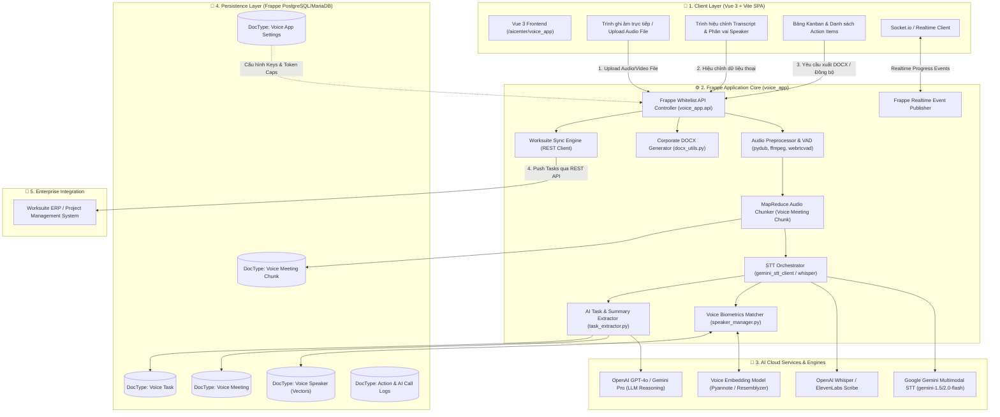
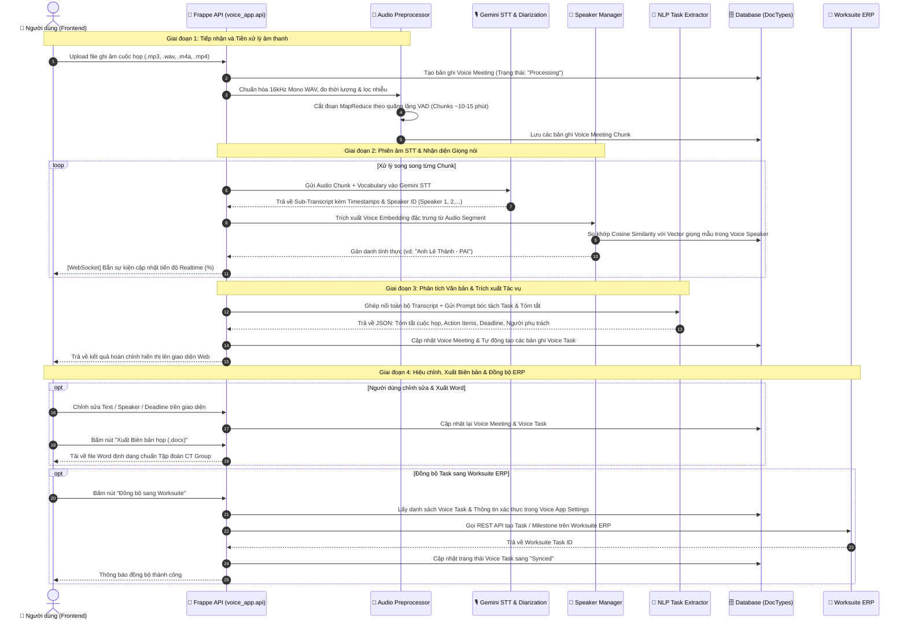
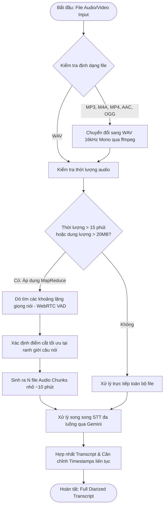
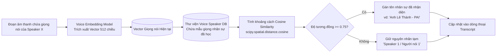
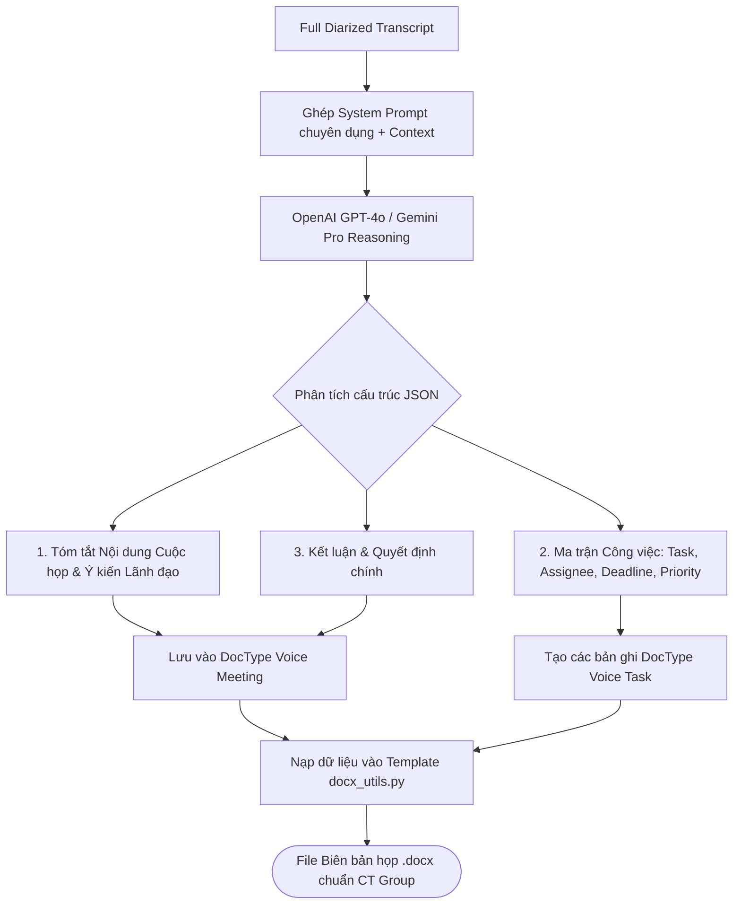
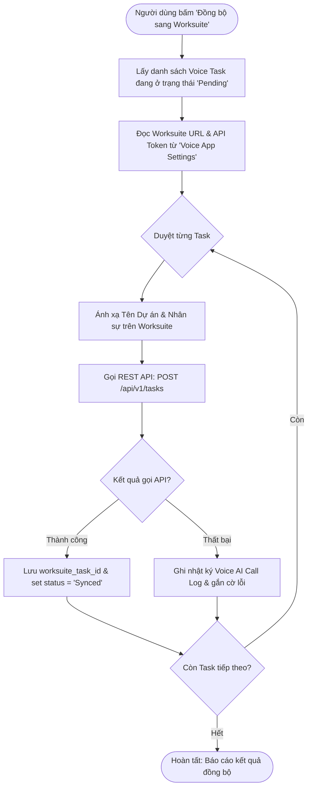
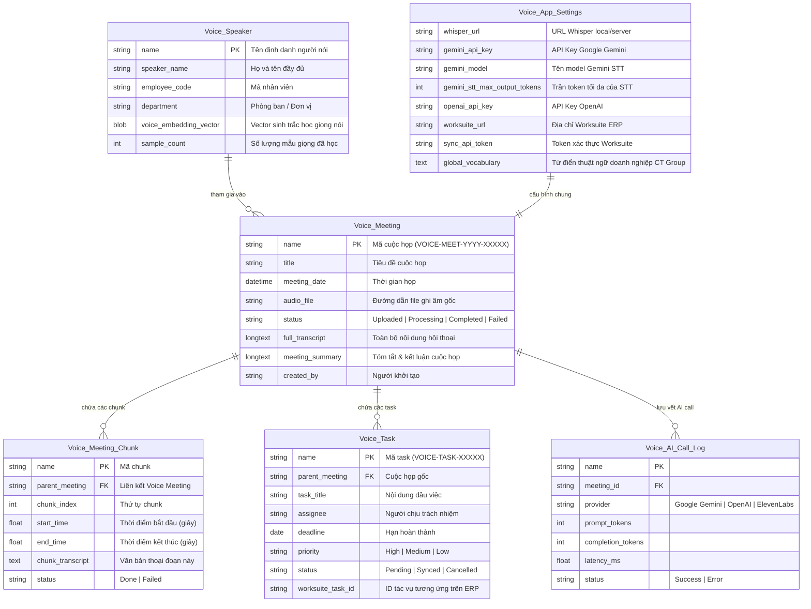

# 🏗️ TÀI LIỆU KIẾN TRÚC & TOÀN BỘ LUỒNG HOẠT ĐỘNG: 2AS WORKSUITE (`voice_app`)

> **Dự án:** 2AS WorkSuite - AI Voice Transcription & Task Automation  
> **Phiên bản:** 2.0  
> **Ứng dụng:** `voice_app` (Frappe v15 App + Vue 3 SPA)  
> **Tác giả:** Đội ngũ AI Engineering - CT Group  

---

## 📑 MỤC LỤC
1. [Tổng quan Kiến trúc Hệ thống (System Architecture)](#1-tổng-quan-kiến-trúc-hệ-thống-system-architecture)
2. [Sơ đồ Luồng Xử lý Toàn trình (End-to-End Sequence Diagram)](#2-sơ-đồ-luồng-xử-lý-toàn-trình-end-to-end-sequence-diagram)
3. [Luồng Xử lý Âm thanh & MapReduce Chunking](#3-luồng-xử-lý-âm-thanh--mapreduce-chunking)
4. [Luồng Nhận diện Giọng nói Sinh trắc học (Speaker Biometrics & Diarization)](#4-luồng-nhận-diện-giọng-nói-sinh-trắc-học-speaker-biometrics--diarization)
5. [Luồng Bóc tách Tác vụ AI & Tạo Biên bản Họp (Task Extraction & Minutes)](#5-luồng-bóc-tách-tác-vụ-ai--tạo-biên-bản-họp-task-extraction--minutes)
6. [Luồng Đồng bộ Hóa Tác vụ sang Worksuite ERP](#6-luồng-đồng-bộ-hóa-tác-vụ-sang-worksuite-erp)
7. [Cấu trúc Cơ sở Dữ liệu & Thực thể (DocType Schema ERD)](#7-cấu-trúc-cơ-sở-dữ-liệu--thực-thể-doctype-schema-erd)
8. [Danh mục API & Module Mapping](#8-danh-mục-api--module-mapping)

---

## 1. Tổng quan Kiến trúc Hệ thống (System Architecture)

---

## 2. Sơ đồ Luồng Xử lý Toàn trình (End-to-End Sequence Diagram)

---

## 3. Luồng Xử lý Âm thanh & MapReduce Chunking

---

## 4. Luồng Nhận diện Giọng nói Sinh trắc học (Speaker Biometrics & Diarization)

---

## 5. Luồng Bóc tách Tác vụ AI & Tạo Biên bản Họp (Task Extraction & Minutes)

---

## 6. Luồng Đồng bộ Hóa Tác vụ sang Worksuite ERP

---

## 7. Cấu trúc Cơ sở Dữ liệu & Thực thể (DocType Schema ERD)

---

## 8. Danh mục API & Module Mapping

| Endpoint API (Frappe Method) | Module nguồn | Mục đích sử dụng |
| :--- | :--- | :--- |
| `voice_app.api.get_context` | `voice_app/api.py` | Khởi tạo phiên làm việc, cấp CSRF token và thông tin user hiện tại. |
| `voice_app.api.process_meeting_audio` | `voice_app/api.py` | Tiếp nhận file audio, kích hoạt toàn bộ pipeline MapReduce STT. |
| `voice_app.api.get_meeting_detail` | `voice_app/api.py` | Lấy chi tiết Transcript, danh sách Speaker, Tóm tắt và Task của cuộc họp. |
| `voice_app.api.update_transcript_segment`| `voice_app/api.py` | Cập nhật đoạn văn bản thoại hoặc gán lại Speaker thủ công. |
| `voice_app.api.extract_tasks` | `voice_app/task_extractor.py`| Chạy lại AI LLM để bóc tách lại Task và Action Items từ Transcript. |
| `voice_app.api.export_docx` | `voice_app/docx_utils.py` | Xuất Biên bản cuộc họp chính thức ra định dạng `.docx` theo chuẩn CT Group. |
| `voice_app.api.sync_to_worksuite` | `voice_app/api.py` | Đẩy danh sách Voice Task đã duyệt sang hệ thống Worksuite ERP. |
| `voice_app.api.register_speaker_sample` | `voice_app/speaker_manager.py` | Nạp mẫu âm thanh mới để huấn luyện nhận diện giọng nói cho nhân sự. |

---

## 💡 9. Tổng kết Giá trị Nghiệp vụ:
- **Tự động hóa 100% quy trình họp:** Từ lúc bật ghi âm đến khi sinh ra Biên bản họp hoàn chỉnh chỉ mất **1-2 phút**.
- **Chính xác theo văn hóa CT Group:** Nhận diện chuẩn xác các từ khóa đặc thù như *CT Group, CCTPA, VGCT, Metrostar, Green Bond, Carbon Credit, LiDAR, eVTOL...*
- **Liên thông dữ liệu:** Không còn tình trạng giao việc miệng bị quên; mọi cam kết trong cuộc họp đều được chuyển thành Task số trên hệ thống ERP ngay lập tức.
