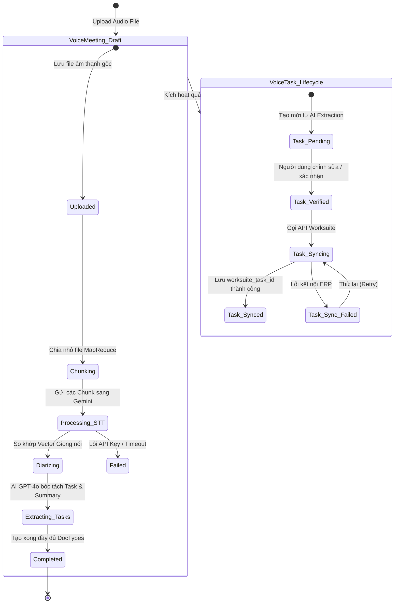
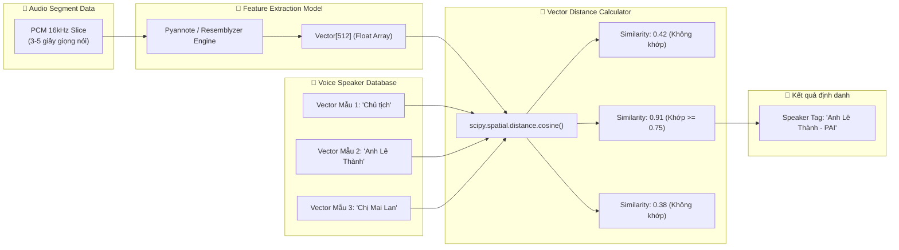
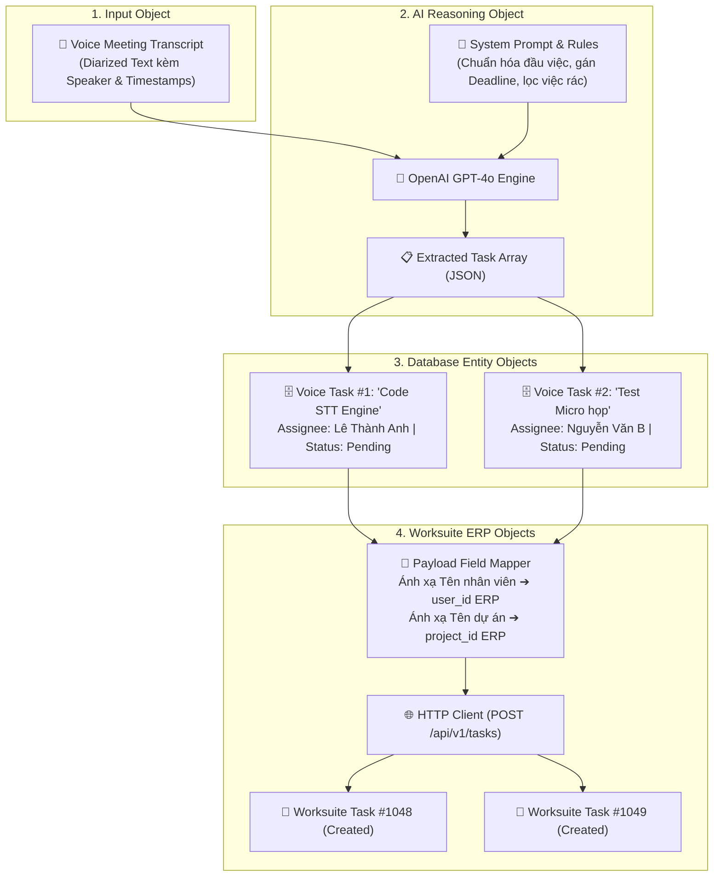
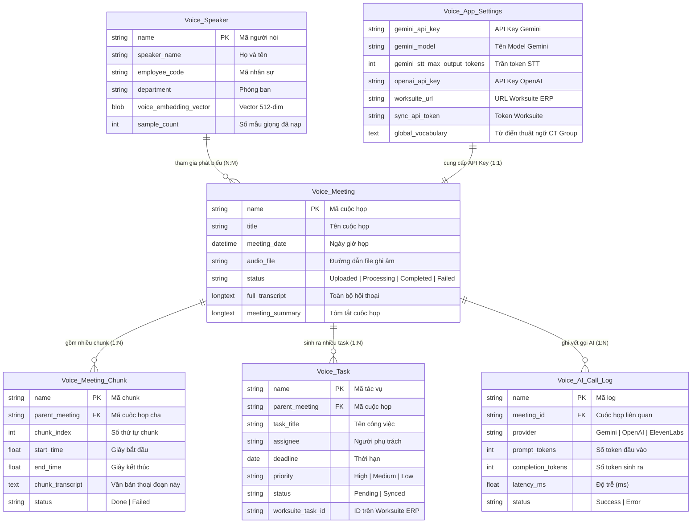

# 🏗️ TÀI LIỆU KIẾN TRÚC & SƠ ĐỒ ĐỐI TƯỢNG (OBJECT-TO-OBJECT FLOW): 2AS WORKSUITE (`voice_app`)

> **Dự án:** 2AS WorkSuite - AI Voice Transcription & Task Automation  
> **Kiểu sơ đồ:** Object-to-Object Flow (Luồng Chuyển hóa Đối tượng & Dữ liệu Thực thể)  
> **Ứng dụng:** `voice_app` (Frappe v15 App + Vue 3 SPA)  
> **Tác giả:** Đội ngũ AI Engineering - CT Group  

---

## 📑 MỤC LỤC
1. [Sơ đồ Luồng Đối tượng Toàn trình (End-to-End Object-to-Object Flow)](#1-sơ-đồ-luồng-đối-tượng-toàn-trình-end-to-end-object-to-object-flow)
2. [Chi tiết Cấu trúc Dữ liệu & Biến đổi Đối tượng (Data Transformation Breakdown)](#2-chi-tiết-cấu-trúc-dữ-liệu--biến-đổi-đối-tượng-data-transformation-breakdown)
3. [Sơ đồ Chuyển hóa Trạng thái Đối tượng (Object Lifecycle & State Transitions)](#3-sơ-đồ-chuyển-hóa-trạng-thái-đối-tượng-object-lifecycle--state-transitions)
4. [Sơ đồ Đối tượng Nhận diện Sinh trắc học Giọng nói (Voice Biometrics Object Flow)](#4-sơ-đồ-đối-tượng-nhận-diện-sinh-trắc-học-giọng-nói-voice-biometrics-object-flow)
5. [Sơ đồ Đối tượng Bóc tách Tác vụ & Đồng bộ ERP (Task Extraction to ERP Object Flow)](#5-sơ-đồ-đối-tượng-bóc-tách-tác-vụ--đồng-bộ-erp-task-extraction-to-erp-object-flow)
6. [Sơ đồ Liên kết Thực thể Dữ liệu (DocType Entity Relationship)](#6-sơ-đồ-liên-kết-thực-thể-dữ-liệu-doctype-entity-relationship)

---

## 1. Sơ đồ Luồng Đối tượng Toàn trình (End-to-End Object-to-Object Flow)

Sơ đồ thể hiện cách các đối tượng dữ liệu (Data Objects) sinh ra, biến đổi và truyền nhận giữa các thành phần từ lúc nhận File âm thanh đầu vào cho đến khi tạo ra Task trên Worksuite ERP:

```mermaid
flowchart TD
    %% Input Objects
    classDef inputObj fill:#e1f5fe,stroke:#0288d1,stroke-width:2px,color:#01579b;
    classDef processObj fill:#fff3e0,stroke:#f57c00,stroke-width:2px,color:#e65100;
    classDef aiObj fill:#f3e5f5,stroke:#7b1fa2,stroke-width:2px,color:#4a148c;
    classDef dbObj fill:#e8f5e9,stroke:#388e3c,stroke-width:2px,color:#1b5e20;
    classDef erpObj fill:#fbe9e7,stroke:#d84315,stroke-width:2px,color:#bf360c;

    subgraph Phase1["🎵 GIAI ĐOẠN 1: AUDIO OBJECTS"]
        RawAudio["📦 RawAudioFileObject<br/>• filename: .mp3 / .m4a / .wav<br/>• file_size: bytes<br/>• stream / buffer"]:::inputObj
        
        PcmWav["📦 NormalizedAudioObject<br/>• format: WAV PCM 16kHz Mono<br/>• duration_sec: float<br/>• sample_rate: 16000"]:::processObj
        
        AudioChunks["📦 AudioChunkObject [1..N]<br/>• chunk_id: str<br/>• chunk_index: int<br/>• start_time / end_time<br/>• chunk_bytes: wav"]:::processObj
    end

    subgraph Phase2["🎙️ GIAI ĐOẠN 2: STT & SPEAKER DIARIZATION OBJECTS"]
        GlobalVocab["⚙️ GlobalVocabularyConfig<br/>• CT Group, VGCT, CCTPA, LiDAR..."]:::inputObj
        
        GeminiRawResp["📦 GeminiSTTResponseObject<br/>• segments: Array<br/>&nbsp;&nbsp;├ start_sec / end_sec<br/>&nbsp;&nbsp;├ raw_speaker_id: 'Speaker 1'<br/>&nbsp;&nbsp;└ text: 'Nội dung phát biểu'"]:::aiObj
        
        SpeakerEmbedding["📦 AudioSegmentEmbedding<br/>• vector: Float32Array[512]<br/>• sample_rate: 16000"]:::aiObj
        
        VoiceSpeakerProfile["👤 VoiceSpeakerProfile (DB)<br/>• speaker_name: 'Anh Lê Thành'<br/>• employee_code: 'CT001'<br/>• stored_embedding: Float32[512]"]:::dbObj
        
        DiarizedSegment["📦 AnnotatedTranscriptSegment<br/>• segment_index: int<br/>• start_time: 00:01:25<br/>• end_time: 00:02:10<br/>• speaker_name: 'Anh Lê Thành'<br/>• department: 'PAI'<br/>• content: 'Triển khai dự án AI'"]:::processObj
    end

    subgraph Phase3["🧠 GIAI ĐOẠN 3: MEETING INTELLIGENCE & TASK OBJECTS"]
        FullMeetingTranscript["📦 FullMeetingTranscriptObject<br/>• meeting_id: 'VOICE-MEET-2026-001'<br/>• title: 'Họp triển khai PAI'<br/>• full_segments: Array&lt;Segment&gt;<br/>• attendees: Array&lt;Speaker&gt;"]:::processObj
        
        LLMTaskPayload["📦 LLMTaskExtractionPrompt<br/>• system_prompt: CT Group Rules<br/>• transcript_text: Full Text<br/>• response_schema: JSON"]:::aiObj
        
        LLMExtractionJSON["📦 LLMStructuredOutputObject<br/>• summary: 'Tóm tắt kết luận'<br/>• key_decisions: Array&lt;str&gt;<br/>• extracted_tasks: Array&lt;Task&gt;<br/>&nbsp;&nbsp;├ title: 'Hoàn thiện API'<br/>&nbsp;&nbsp;├ assignee: 'Lê Thành Anh'<br/>&nbsp;&nbsp;├ deadline: '2026-08-30'<br/>&nbsp;&nbsp;└ priority: 'High'"]:::aiObj
    end

    subgraph Phase4["💾 GIAI ĐOẠN 4: DOCTYPE DATABASE ENTITIES"]
        DocVoiceMeeting["🗄️ DocType: Voice Meeting<br/>• name: VOICE-MEET-2026-001<br/>• full_transcript: longtext<br/>• meeting_summary: longtext<br/>• status: 'Completed'"]:::dbObj
        
        DocVoiceMeetingChunk["🗄️ DocType: Voice Meeting Chunk [N]<br/>• parent: VOICE-MEET-2026-001<br/>• chunk_transcript: text<br/>• status: 'Done'"]:::dbObj
        
        DocVoiceTask["🗄️ DocType: Voice Task [1..M]<br/>• parent: VOICE-MEET-2026-001<br/>• task_title: 'Hoàn thiện API'<br/>• assignee: 'Lê Thành Anh'<br/>• deadline: 2026-08-30<br/>• status: 'Pending'"]:::dbObj
    end

    subgraph Phase5["🏢 GIAI ĐOẠN 5: OUTPUT & EXTERNAL ERP OBJECTS"]
        DocxTemplateContext["📄 DocxTemplateContextObject<br/>• company_logo: 'CTGROUP.png'<br/>• meeting_title: str<br/>• summary_table: HTML/Dict<br/>• task_matrix: Array&lt;Task&gt;"]:::processObj
        
        DocxFile["📄 WordReportFileObject<br/>• filename: 'BienBanHop_PAI.docx'<br/>• format: DOCX binary"]:::inputObj
        
        WorksuiteTaskPayload["📦 WorksuiteTaskRESTPayload<br/>• project_id: 'PRJ-101'<br/>• heading: 'Hoàn thiện API'<br/>• user_id: 'USR-88'<br/>• due_date: '2026-08-30'"]:::erpObj
        
        WorksuiteTaskResponse["🏢 WorksuiteTaskRecord (ERP)<br/>• id: 1849<br/>• status: 'in_progress'<br/>• created_at: datetime"]:::erpObj
    end

    %% Object Transformations Flow
    RawAudio -->|pydub / ffmpeg normalize| PcmWav
    PcmWav -->|WebRTC VAD split| AudioChunks
    
    AudioChunks -->|Map: Gửi Audio Chunk + Vocab| GeminiRawResp
    GlobalVocab -.-> GeminiRawResp
    
    AudioChunks -->|Extract Audio Slices| SpeakerEmbedding
    SpeakerEmbedding <-->|Cosine Similarity Match| VoiceSpeakerProfile
    
    GeminiRawResp -->|Gán Speaker Profile| DiarizedSegment
    VoiceSpeakerProfile -.-> DiarizedSegment
    
    DiarizedSegment -->|Reduce: Ghép toàn bộ segments| FullMeetingTranscript
    AudioChunks -->|Lưu vết chunks| DocVoiceMeetingChunk
    
    FullMeetingTranscript -->|Đóng gói Prompt| LLMTaskPayload
    LLMTaskPayload -->|OpenAI GPT-4o Inference| LLMExtractionJSON
    
    LLMExtractionJSON -->|Save Meeting Header & Summary| DocVoiceMeeting
    LLMExtractionJSON -->|Save Task Rows| DocVoiceTask
    DocVoiceMeeting -.->|Has Many| DocVoiceTask
    DocVoiceMeeting -.->|Has Many| DocVoiceMeetingChunk
    
    DocVoiceMeeting & DocVoiceTask -->|Build Context| DocxTemplateContext
    DocxTemplateContext -->|Render docx_utils.py| DocxFile
    
    DocVoiceTask -->|Map Field & User ID| WorksuiteTaskPayload
    WorksuiteTaskPayload -->|POST /api/v1/tasks| WorksuiteTaskResponse
    WorksuiteTaskResponse -->|Update worksuite_task_id & set status='Synced'| DocVoiceTask
```



---

## 2. Chi tiết Cấu trúc Dữ liệu & Biến đổi Đối tượng (Data Transformation Breakdown)

### 🔹 Bước 1: `RawAudioFileObject` ➔ `NormalizedAudioObject` ➔ `AudioChunkObject[]`
```json
// AudioChunkObject
{
  "chunk_id": "CHK_VOICE_001_01",
  "chunk_index": 1,
  "start_time_sec": 0.0,
  "end_time_sec": 624.5,
  "sample_rate": 16000,
  "audio_base64_or_path": "/private/files/chunks/chunk_01.wav"
}
```

### 🔹 Bước 2: `GeminiSTTResponseObject` ➔ `AnnotatedTranscriptSegment[]`
```json
// AnnotatedTranscriptSegment (Sau khi nhận diện giọng nói)
{
  "segment_index": 3,
  "start_time": "00:02:15",
  "end_time": "00:03:40",
  "raw_speaker_tag": "Speaker 2",
  "identified_speaker": {
    "speaker_id": "SPK-0012",
    "name": "Lê Thành Anh",
    "department": "PAI",
    "confidence_score": 0.89
  },
  "text": "Nhóm AI sẽ hoàn thiện module nhận diện giọng nói và bàn giao trước ngày 30 tháng 8."
}
```

### 🔹 Bước 3: `LLMStructuredOutputObject` ➔ `DocType: Voice Task[]`
```json
// LLMStructuredOutputObject
{
  "meeting_summary": "Cuộc họp thống nhất tiến độ triển khai dự án AI Voice Transcription, phê duyệt kế hoạch tích hợp Worksuite ERP.",
  "key_decisions": [
    "Sử dụng Gemini Flash làm STT chính và GPT-4o cho bóc tách Task",
    "Đồng bộ trực tiếp Task sang Worksuite ERP sau khi họp xong"
  ],
  "tasks": [
    {
      "task_title": "Hoàn thiện module nhận diện giọng nói (Speaker Diarization)",
      "assignee": "Lê Thành Anh",
      "department": "PAI",
      "deadline": "2026-08-30",
      "priority": "High",
      "notes": "Trích xuất từ phát biểu của Lê Thành Anh lúc 00:02:15"
    }
  ]
}
```

---

## 3. Sơ đồ Chuyển hóa Trạng thái Đối tượng (Object Lifecycle & State Transitions)



---

## 4. Sơ đồ Đối tượng Nhận diện Sinh trắc học Giọng nói (Voice Biometrics Object Flow)



---

## 5. Sơ đồ Đối tượng Bóc tách Tác vụ & Đồng bộ ERP (Task Extraction to ERP Object Flow)



---

## 6. Sơ đồ Liên kết Thực thể Dữ liệu (DocType Entity Relationship)


