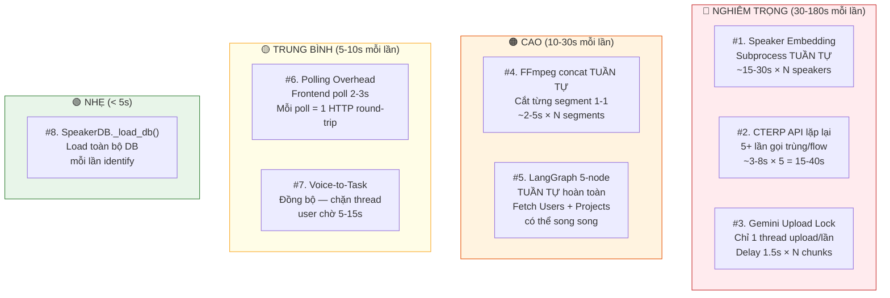
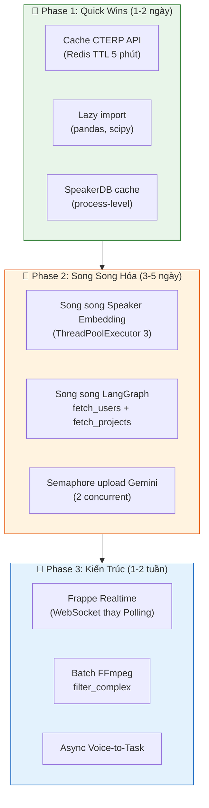

# 🚀 BÁO CÁO ĐÁNH GIÁ HIỆU SUẤT & ĐỀ XUẤT TỐI ƯU HÓA

> **Hệ thống:** 2AS-Worksuite  
> **Ngày đánh giá:** 11/07/2026  
> **Dựa trên:** Phân tích toàn bộ source code

---

## I. BẢN ĐỒ NÚT THẮT CỔ CHAI (BOTTLENECK MAP)

Dưới đây là **8 điểm nghẽn** được xếp hạng từ **nghiêm trọng nhất** đến ít nghiêm trọng:



---

## II. PHÂN TÍCH CHI TIẾT TỪNG NÚT THẮT

### 🔴 #1. Speaker Embedding — SUBPROCESS TUẦN TỰ (Nghiêm trọng nhất)

**File:** [api.py#L212-L244](file:///d:/CTGroup/Mlops/data_center/ct_agent_hub_BE/frappe-bench/apps/2as-worksuite/voice_app/api.py#L212-L244)

**Vấn đề:** Mỗi speaker cần trích xuất embedding bằng cách chạy một **subprocess Python hoàn toàn mới** (`extract_embedding.py`). Subprocess này phải:
1. Import PyTorch (~2-3s)
2. Load model pyannote/embedding (~3-5s lần đầu, ~1s nếu cached)
3. Đọc audio + inference (~2-5s)

**Tổng thời gian cho 1 speaker:** ~5-15s (tùy cache)

**Quan trọng:** Vòng lặp này chạy **TUẦN TỰ**:
```python
for spk, segs in unique_speakers.items():  # ← TUẦN TỰ!
    concat_wav = concat_speaker_segments(wav, segs, ...)
    emb = get_segment_embedding(...)  # ← subprocess mỗi lần!
```

**Với cuộc họp 8 người:** `8 × 10s = ~80s` chỉ riêng bước nhận diện giọng!

> [!CAUTION]
> Đây là nút thắt **lớn nhất** trong toàn bộ pipeline. Mỗi subprocess đều phải load lại PyTorch từ đầu vì cơ chế isolation (tránh DNNL crash trong Gunicorn).

---

### 🔴 #2. Gọi CTERP API lặp lại quá nhiều lần

**File:** [api.py](file:///d:/CTGroup/Mlops/data_center/ct_agent_hub_BE/frappe-bench/apps/2as-worksuite/voice_app/api.py) — nhiều vị trí

**Vấn đề:** Cùng một API `GET /api/resource/Employee` (limit 5000) được gọi **ít nhất 5 lần** trong cùng 1 flow:

| Vị trí | Dòng | Khi nào |
|--------|------|---------|
| `_transcribe_audio_async` → `check_meeting_status` (kết quả) | L80 | Khi trả kết quả transcribe |
| `_transcribe_audio_async` (bên trong) | L457 | Sau khi transcript xong |
| `_extract_tasks_async` | L621 | Lấy designation cho speaker_roles |
| `extract_tasks_only` → `node_fetch_users` | task_extractor L261 | LangGraph node |
| `get_enrolled_speakers` | L1240 | Enrichment speakers |

**Mỗi lần gọi:** ~3-8s (network round-trip tới CT ERP, fetch 5000 records)  
**Tổng:** ~15-40s lãng phí cho dữ liệu **hoàn toàn trùng lặp**

---

### 🔴 #3. Gemini Upload Lock — Hạn chế song song

**File:** [gemini_stt_client.py#L510-L534](file:///d:/CTGroup/Mlops/data_center/ct_agent_hub_BE/frappe-bench/apps/2as-worksuite/voice_app/gemini_stt_client.py#L510-L534)

**Vấn đề:** Mặc dù dùng `ThreadPoolExecutor(max_workers=6)`, nhưng bước upload bị **lock chỉ cho 1 thread đi qua** + delay 1.5s:

```python
with _upload_lock:  # ← Chỉ 1 thread upload tại 1 thời điểm
    time.sleep(1.5)  # ← Delay cứng 1.5s
    file_uri, file_name = _upload_file(current_wav, api_key)
```

**Với file 2 giờ (= 4 chunks 30 phút):**
- Upload tuần tự: `4 × (1.5s delay + 30-60s upload) = ~2-4 phút`
- Sau upload mới stream song song

---

### 🟠 #4. FFmpeg concat segments — TUẦN TỰ cho từng speaker

**File:** [audio_utils.py#L46-L137](file:///d:/CTGroup/Mlops/data_center/ct_agent_hub_BE/frappe-bench/apps/2as-worksuite/voice_app/audio_utils.py#L46-L137)

**Vấn đề:** `concat_speaker_segments()` cắt từng segment bằng FFmpeg subprocess → **mỗi lần FFmpeg = 1 subprocess mới**:

```python
for seg in candidates:      # ← Tuần tự từng segment
    subprocess.run(cmd, ...)  # ← FFmpeg subprocess mỗi lần
```

Với 8 speakers × 5-10 segments mỗi speaker = **40-80 lần gọi FFmpeg**.

---

### 🟠 #5. LangGraph Pipeline — Có thể song song hóa 2 node

**File:** [task_extractor.py#L550-L563](file:///d:/CTGroup/Mlops/data_center/ct_agent_hub_BE/frappe-bench/apps/2as-worksuite/voice_app/task_extractor.py#L550-L563)

**Hiện tại (tuần tự):**
```
read_docx → extract_tasks → login → fetch_users → fetch_projects → END
```

**Điểm lãng phí:** `fetch_users` và `fetch_projects` **không phụ thuộc nhau** — cả hai chỉ cần `session` — nhưng đang chạy nối tiếp.

---

### 🟡 #6. Polling Overhead

**Frontend poll mỗi 2-3s** để kiểm tra status. Mỗi lần poll = 1 HTTP request + 1 Redis lookup + 1 HTTP response.

Với file dài 1 giờ, xử lý mất ~5-10 phút:
- Số lần poll: `300s / 2.5s = ~120 requests`
- Mỗi request ~50-100ms → ~6-12s overhead tổng

> [!NOTE]
> **Về comment của bạn:** *"vì khi sử dụng cơ chế websocket này hệ thống sẽ không thể xử lý được thanh tiến trình"*
>
> Thực ra **WebSocket CÓ THỂ** hiển thị thanh tiến trình — thậm chí còn **tốt hơn polling**. Với WebSocket, server **push** progress ngay lập tức khi có cập nhật, thay vì phải chờ client hỏi. Frappe đã có sẵn cơ chế `frappe.publish_realtime()` dùng Socket.IO:
>
> ```python
> # Backend: push progress ngay khi có
> frappe.publish_realtime('transcribe_progress', {
>     'meeting_name': meeting_name,
>     'stt': {'progress': 75, 'msg': 'Đang xử lý chunk 3/4...'},
>     'speaker': {'progress': 0, 'msg': 'Chờ...'}
> }, user=frappe.session.user)
> ```
>
> ```javascript
> // Frontend: nhận ngay lập tức, không cần poll
> frappe.realtime.on('transcribe_progress', (data) => {
>     updateProgressBar(data.stt.progress, data.stt.msg)
> })
> ```
>
> **Lợi ích WebSocket so với Polling:**
> - ⚡ Cập nhật **real-time** (0ms delay thay vì 2-3s)
> - 🔋 Giảm ~120 HTTP requests/flow → 0
> - 📊 Thanh tiến trình **mượt hơn** (cập nhật liên tục thay vì nhảy cóc mỗi 2-3s)
>
> **Tuy nhiên**, lý do hiện tại dùng polling vẫn hợp lý vì: Frappe background worker (Redis Queue) chạy ở process khác với web process, nên `frappe.publish_realtime()` trong background job cần cấu hình thêm `after_commit=False`. Polling đơn giản hơn để implement ban đầu.

---

### 🟡 #7. Voice-to-Task — Đồng bộ & chặn thread

**File:** [api.py#L1335-L1585](file:///d:/CTGroup/Mlops/data_center/ct_agent_hub_BE/frappe-bench/apps/2as-worksuite/voice_app/api.py#L1335-L1585)

User phải **chờ đồng bộ** 5-15s:
1. ElevenLabs STT (~3-5s)
2. Fetch Projects + Employees từ CTERP (~3-5s)
3. OpenAI GPT-4o (~3-8s)

---

## III. ĐỀ XUẤT TỐI ƯU HÓA

### ✅ Đề xuất 1: Song song hóa Speaker Embedding (Tiết kiệm ~60-80%)

> [!IMPORTANT]
> **Ưu tiên cao nhất.** Đây là thay đổi có impact lớn nhất.

**Hiện tại:** Tuần tự, 8 speakers × 10s = 80s  
**Đề xuất:** Dùng `ThreadPoolExecutor` hoặc `ProcessPoolExecutor`

```python
# ĐỀ XUẤT: Song song hóa embedding extraction
from concurrent.futures import ThreadPoolExecutor, as_completed

def _extract_one_speaker(spk, segs, wav):
    """Trích xuất embedding cho 1 speaker."""
    concat_wav = concat_speaker_segments(wav, segs, max_total_sec=25.0, min_seg_sec=1.5)
    if concat_wav is None:
        segs_sorted = sorted(segs, key=lambda x: x["end"] - x["start"], reverse=True)
        sample = segs_sorted[0]
        shrink = 0.1 if (sample["end"] - sample["start"] > 0.5) else 0.0
        start = sample["start"] + shrink
        end = sample["end"] - shrink
        if end <= start:
            start, end = sample["start"], sample["end"]
        emb = get_segment_embedding(wav, start, min(end, start + 5.0))
    else:
        dur = get_duration(concat_wav)
        emb = get_segment_embedding(concat_wav, 0.0, dur)
        try: os.remove(concat_wav)
        except: pass
    return spk, emb

# Chạy song song tối đa 3 subprocess cùng lúc
with ThreadPoolExecutor(max_workers=3) as executor:
    futures = {
        executor.submit(_extract_one_speaker, spk, segs, wav): spk
        for spk, segs in unique_speakers.items()
    }
    for future in as_completed(futures):
        spk, emb = future.result()
        if emb is not None:
            spk_embeddings[spk] = emb
        completed_spk += 1
        update_progress(...)
```

**Kết quả dự kiến:** 8 speakers / 3 workers = ~3 batch × 10s = **~30s** (giảm **60%**)

> [!WARNING]
> Giới hạn `max_workers=3` thay vì 8 vì mỗi subprocess load PyTorch tốn ~500MB RAM. 3 workers = ~1.5GB RAM bổ sung.

---

### ✅ Đề xuất 2: Cache CTERP Employee/Project Data (Tiết kiệm ~20-35s)

**Thay vì gọi API 5+ lần, cache trong Redis với TTL 5 phút:**

```python
def get_cached_employees(ttl=300):
    """Cache danh sách nhân viên trong Redis, TTL 5 phút."""
    cache_key = "cterp_employees_cache"
    cached = frappe.cache().get_value(cache_key)
    if cached:
        return cached
    
    token = get_worksuite_token()
    base_url = get_worksuite_url()
    session = requests.Session()
    session.headers.update({"Authorization": f"token {token}", "Accept": "application/json"})
    
    emp_resp = session.get(
        f"{base_url}/api/resource/Employee",
        params={
            "fields": '["name","employee_name","user_id","designation","department"]',
            "filters": '[["status","=","Active"]]',
            "limit_page_length": 5000,
        },
        timeout=10,
    )
    
    if emp_resp.status_code == 200:
        employees = emp_resp.json().get("data", [])
        frappe.cache().set_value(cache_key, employees, expires_in_sec=ttl)
        return employees
    return []
```

**Kết quả:** 5 lần gọi API → **1 lần** (+ 4 cache hit ~0ms mỗi lần)

---

### ✅ Đề xuất 3: Song song hóa LangGraph fetch_users + fetch_projects

**Hiện tại (tuần tự):**
```
login → fetch_users (3-5s) → fetch_projects (3-5s) = 6-10s
```

**Đề xuất:**
```python
# Thay 2 node nối tiếp bằng 1 node song song
def node_fetch_all(state: AgentState) -> dict:
    session = state.get("session")
    if not session:
        return {"frappe_users": [], "frappe_projects": {}}
    
    with ThreadPoolExecutor(max_workers=2) as executor:
        f_users = executor.submit(_fetch_users_impl, session)
        f_projects = executor.submit(_fetch_projects_impl, session)
        
        users = f_users.result()
        projects = f_projects.result()
    
    return {"frappe_users": users, "frappe_projects": projects}
```

**Kết quả:** `max(3s, 5s) = 5s` thay vì `3s + 5s = 8s`

---

### ✅ Đề xuất 4: Pipeline Upload + Stream cho Gemini (Overlap I/O)

**Hiện tại:** Upload chunk 1 → chờ xong → upload chunk 2 → chờ xong → stream tất cả  
**Đề xuất:** Dùng **Semaphore** thay vì Lock, cho phép 2-3 upload đồng thời:

```python
_upload_semaphore = threading.Semaphore(2)  # Cho phép 2 upload đồng thời thay vì 1

def _process_single_chunk(idx, ...):
    with _upload_semaphore:  # 2 concurrent uploads
        time.sleep(0.5)      # Giảm delay từ 1.5s → 0.5s
        file_uri, file_name = _upload_file(current_wav, api_key)
    # Stream response (đã song song sẵn)
    ...
```

**Kết quả:** Upload 4 chunks: `2 batch × (0.5s + 30s) = ~61s` thay vì `4 × (1.5s + 30s) = ~126s`

---

### ✅ Đề xuất 5: Batch FFmpeg — Cắt nhiều segment 1 lần

**Hiện tại:** 1 FFmpeg call = 1 segment  
**Đề xuất:** Dùng FFmpeg filter_complex để cắt nhiều segment cùng lúc:

```python
def concat_speaker_segments_batch(wav_path, segs, max_total_sec=25.0, min_seg_sec=1.0):
    """Cắt + ghép nhiều segment trong 1 lần FFmpeg duy nhất."""
    candidates = sorted(
        [s for s in segs if (s["end"] - s["start"]) >= min_seg_sec],
        key=lambda x: x["end"] - x["start"], reverse=True
    )
    if not candidates:
        return None
    
    # Build filter_complex để cắt nhiều segment + concat 1 phát
    filters = []
    inputs = []
    total = 0.0
    for i, seg in enumerate(candidates):
        start = seg["start"] + 0.2
        end = seg["end"] - 0.2
        if end <= start: continue
        take = min(end - start, max_total_sec - total)
        if take <= 0: break
        filters.append(f"[0]atrim=start={start:.3f}:duration={take:.3f},asetpts=PTS-STARTPTS[s{i}]")
        inputs.append(f"[s{i}]")
        total += take
    
    concat_filter = "".join(inputs) + f"concat=n={len(inputs)}:v=0:a=1[out]"
    full_filter = ";".join(filters) + ";" + concat_filter
    
    out = tempfile.NamedTemporaryFile(suffix=".wav", delete=False).name
    cmd = ["ffmpeg", "-y", "-i", wav_path, "-filter_complex", full_filter,
           "-map", "[out]", "-ar", "16000", "-ac", "1", "-c:a", "pcm_s16le", out]
    subprocess.run(cmd, capture_output=True)
    return out
```

**Kết quả:** N lần FFmpeg → **1 lần** (tiết kiệm ~N×2s startup overhead)

---

### ✅ Đề xuất 6: Chuyển Voice-to-Task sang Async

```python
@frappe.whitelist(allow_guest=False)
def voice_to_task(existing_task=None):
    # ... validate, save file ...
    
    # Enqueue thay vì chạy đồng bộ
    job_key = f"v2t_{frappe.session.user}_{int(time.time())}"
    frappe.enqueue(
        'voice_app.api._voice_to_task_async',
        queue='short',  # Queue ngắn vì chỉ ~10s
        timeout=60,
        job_key=job_key,
        file_path=file_path,
        existing_task=existing_task,
        user=frappe.session.user,
    )
    return {"status": "processing", "job_key": job_key}
```

**Kết quả:** User không bị chặn thread, UI có thể hiển thị animation trong lúc chờ.

---

### ✅ Đề xuất 7: Chuyển sang Frappe Realtime (WebSocket)

Thay polling bằng `frappe.publish_realtime()` — **Frappe hỗ trợ sẵn**:

```python
# Backend (trong background worker)
def _transcribe_audio_async(...):
    def update_progress(stt_pct, stt_msg, spk_pct, spk_msg):
        # Thay vì chỉ cache:
        frappe.cache().set_value(f"transcribe_progress_{meeting_name}", {...})
        
        # THÊM: Push realtime tới user
        frappe.publish_realtime(
            event='transcribe_progress',
            message={
                'meeting_name': meeting_name,
                'stt': {'progress': stt_pct, 'msg': stt_msg},
                'speaker': {'progress': spk_pct, 'msg': spk_msg}
            },
            user=user,  # Chỉ push tới user đang chờ
            after_commit=False  # Quan trọng: push ngay, không chờ commit
        )
```

```javascript
// Frontend (VoiceTranscribe.vue)
// Thay thế setInterval polling
frappe.realtime.on('transcribe_progress', (data) => {
    if (data.meeting_name === currentMeetingName.value) {
        sttProgress.value = data.stt.progress
        sttMessage.value = data.stt.msg
        speakerProgress.value = data.speaker.progress
        speakerMessage.value = data.speaker.msg
    }
})

frappe.realtime.on('transcribe_complete', (data) => {
    // Fetch kết quả cuối cùng
    loadTranscriptResults(data.meeting_name)
})
```

---

### ✅ Đề xuất 8: Preload SpeakerDB 1 lần duy nhất

**Hiện tại:** `SpeakerDB()` load toàn bộ DB mỗi khi khởi tạo (L194)  
**Đề xuất:** Cache ở process level hoặc Redis:

```python
_speaker_db_cache = None
_speaker_db_ts = 0

def get_speaker_db(ttl=60):
    global _speaker_db_cache, _speaker_db_ts
    if _speaker_db_cache and (time.time() - _speaker_db_ts) < ttl:
        return _speaker_db_cache
    _speaker_db_cache = SpeakerDB()
    _speaker_db_ts = time.time()
    return _speaker_db_cache
```

---

### ✅ Đề xuất 9: Lazy Import trong api.py

**Vấn đề:** `import pandas as pd` và `from scipy.spatial.distance import cosine` ở đầu file → load khi Gunicorn startup dù chưa cần.

**Đề xuất:** Move vào bên trong function khi cần:
```python
# Thay vì import pandas ở đầu file
# import pandas as pd  ← XÓA

def _extract_tasks_async(...):
    import pandas as pd  # ← Chỉ import khi thực sự cần
    df = pd.DataFrame(items)
```

---

### ✅ Đề xuất 10: Giảm chunk size Gemini từ 30 phút → 15 phút

**Lý do:** Chunk 30 phút = response rất dài → dễ bị MAX_TOKENS → Smart Resume mất thêm thời gian.

Chunk 15 phút:
- Ít bị hallucination hơn
- Nhiều chunk hơn nhưng chạy song song → tổng thời gian tương đương
- Mỗi chunk nhẹ hơn → ít risk timeout

---

### ✅ Đề xuất 11: Connection Pooling cho CTERP

```python
# Tạo 1 session dùng chung cho toàn bộ flow
_cterp_session = None

def get_cterp_session():
    global _cterp_session
    if _cterp_session is None:
        _cterp_session = requests.Session()
        token = get_worksuite_token()
        _cterp_session.headers.update({
            "Authorization": f"token {token}", 
            "Accept": "application/json"
        })
        # Connection pooling
        from requests.adapters import HTTPAdapter
        _cterp_session.mount('https://', HTTPAdapter(pool_connections=5, pool_maxsize=10))
    return _cterp_session
```

---

### ✅ Đề xuất 12: Chạy STT + Employee fetch song song trong Extract Tasks

**Hiện tại (tuần tự):**
```
fetch speaker_roles từ CTERP (3-5s) → save_to_docx (1-2s) → extract_tasks_only (LangGraph 10-15s)
```

**Đề xuất:** Fetch speaker_roles **đồng thời** với save_to_docx:
```python
with ThreadPoolExecutor(max_workers=2) as executor:
    f_roles = executor.submit(fetch_speaker_roles)  # Song song
    f_docx = executor.submit(save_to_docx, results)  # Song song
    
    speaker_roles = f_roles.result()
    docx_filename = f_docx.result()
```

---

## IV. BẢNG TỔNG HỢP: TRƯỚC & SAU TỐI ƯU

**Scenario:** File ghi âm **2 giờ**, **8 người tham dự**, mode Google Gemini

| Bước | Hiện tại | Sau tối ưu | Tiết kiệm |
|------|----------|------------|------------|
| Convert WAV | 5s | 5s | 0s |
| Split audio (VAD) | 3s | 3s | 0s |
| Upload Gemini (4 chunks) | 126s *(lock tuần tự)* | ~61s *(semaphore 2)* | **~65s** |
| Gemini STT streaming | 120s *(đã song song 6 threads)* | 120s | 0s |
| Speaker Embedding (8 người) | **80s** *(tuần tự subprocess)* | **30s** *(song song 3 workers)* | **~50s** |
| FFmpeg concat segments | 20s *(N subprocess)* | 5s *(batch filter_complex)* | **~15s** |
| CTERP Employee fetch ×5 | 25s *(5 calls trùng)* | 5s *(1 call + cache)* | **~20s** |
| Greedy Assignment + Format | 2s | 2s | 0s |
| Save to DB | 1s | 1s | 0s |
| **TỔNG TRANSCRIBE** | **~382s (~6.4 phút)** | **~232s (~3.9 phút)** | **~150s (39%)** |
|||||
| Fetch designations (Extract) | 5s | 0s *(cached)* | **5s** |
| Save DOCX | 2s | 2s | 0s |
| LangGraph (read+extract+login+fetch) | 15s *(5 nodes tuần tự)* | 10s *(fetch song song)* | **5s** |
| Save Excel | 1s | 1s | 0s |
| **TỔNG EXTRACT** | **~23s** | **~13s** | **~10s (43%)** |
|||||
| **TỔNG END-TO-END** | **~405s (~6.75 phút)** | **~245s (~4.1 phút)** | **~160s (40%)** |

---

## V. ĐỀ XUẤT ƯU TIÊN TRIỂN KHAI



| Phase | Effort | Impact | ROI |
|-------|--------|--------|-----|
| **Phase 1** | 1-2 ngày | Giảm ~25s | ⭐⭐⭐⭐⭐ (rất cao) |
| **Phase 2** | 3-5 ngày | Giảm ~120s | ⭐⭐⭐⭐ (cao) |
| **Phase 3** | 1-2 tuần | Giảm ~15s + UX tốt hơn | ⭐⭐⭐ (trung bình) |

---

## VI. CÁC ĐIỂM KHÔNG NÊN THAY ĐỔI

> [!TIP]
> Không phải mọi thứ tuần tự đều cần song song hóa. Dưới đây là những phần **nên giữ nguyên tuần tự**:

| Phần | Lý do giữ tuần tự |
|------|-------------------|
| **Greedy Speaker Assignment** | Thuật toán yêu cầu xử lý theo thứ tự score giảm dần — song song sẽ gây race condition |
| **Constrained Clustering (Người lạ)** | Kết quả group trước ảnh hưởng group sau — bản chất tuần tự |
| **Segment merging** | Gộp segment liền kề cần scan theo thời gian — O(n) tuần tự là tối ưu |
| **Sync to ERP (Transactional)** | Cần rollback toàn bộ nếu 1 task lỗi — song song sẽ phá vỡ atomicity |
| **DOCX generation** | python-docx không thread-safe, và thời gian < 2s không đáng song song |

---

## VII. KẾT LUẬN

**Điểm chậm nhất:** 🔴 **Speaker Embedding subprocess** (~80s cho 8 người) — chiếm **~20% tổng thời gian** của cả flow transcribe.

**Điểm lãng phí nhất:** 🔴 **CTERP API gọi trùng 5+ lần** — hoàn toàn có thể loại bỏ bằng cache đơn giản.

**Điểm có ROI cao nhất:** ✅ **Cache CTERP + Song song Speaker Embedding** — 2 thay đổi này giảm ~70s (~18%) với effort thấp.

**Tổng thể:** Hệ thống hiện tại được thiết kế khá tốt — đặc biệt là cơ chế song song Gemini chunks và Smart Resume. Các đề xuất trên tập trung vào **"low-hanging fruit"** — những thay đổi nhỏ nhưng impact lớn, không phá vỡ kiến trúc hiện có.
