# 📋 BÁO CÁO PHÂN TÍCH HỆ THỐNG 2AS-WORKSUITE

> **Ngày phân tích:** 11/07/2026  
> **Source path:** `d:\CTGroup\Mlops\data_center\ct_agent_hub_BE\frappe-bench\apps\2as-worksuite`  
> **Platform:** Frappe Framework (Python Backend + Vue.js SPA Frontend)

---

## I. TỔNG QUAN HỆ THỐNG

**2AS-Worksuite** là một ứng dụng AI Voice Meeting Intelligence — hệ thống trí tuệ nhân tạo xử lý ghi âm cuộc họp, tích hợp vào hệ sinh thái CT Group. Hệ thống thực hiện **5 chức năng chính**:

| # | Chức năng | Mô tả |
|---|-----------|-------|
| 1 | **Speech-to-Text (STT)** | Dịch âm thanh → văn bản với speaker diarization |
| 2 | **Speaker Identification** | Nhận diện danh tính người nói qua voice embedding |
| 3 | **Transcript Cleaning** | Làm sạch văn bản bằng LLM (xóa từ đệm, ngập ngừng) |
| 4 | **Task Extraction** | Trích xuất nhiệm vụ/thông báo từ biên bản họp bằng AI |
| 5 | **Voice-to-Task** | Tạo task nhanh bằng giọng nói (1 lệnh voice → 1 task) |

---

## II. KIẾN TRÚC HỆ THỐNG

### 2.1 Stack Công Nghệ

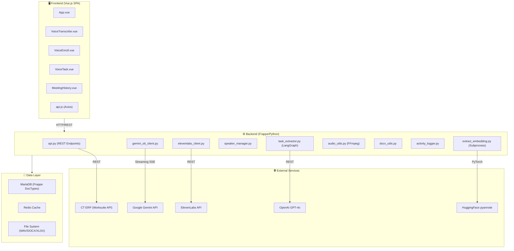

### 2.2 Cấu Trúc DocTypes (Data Models)

| DocType | Vai trò | Trạng thái |
|---------|---------|------------|
| **Voice Meeting** | Lưu trữ cuộc họp: audio, transcript, tasks, files | Pending → Processing → Completed → Analyzed → Synced / Error |
| **Voice Speaker** | CSDL mẫu giọng nói (embedding vector + metadata) | Persistent |
| **Voice App Settings** | Singleton chứa API keys, config | Persistent |
| **VOICE Session** | Session tracking per user | Active → Completed |
| **VOICE Action Log** | Log từng hành động của user | Running → Success/Failed |
| **VOICE AI Call Log** | Log chi tiết mỗi lần gọi AI (tokens, cost) | Per-call record |
| **Voice Task** | Lưu trữ task đã trích xuất | Persistent |

---

## III. CÁC LUỒNG XỬ LÝ CHI TIẾT

### 3.1 🎙️ LUỒNG 1: Transcribe Audio (Luồng chính — Phức tạp nhất)

> **Loại:** Luồng **BẤT ĐỒNG BỘ** (Async via `frappe.enqueue` → Redis Queue)  
> **Timeout:** 3600s (1 giờ)  
> **Bên trong:** Kết hợp **SONG SONG** (ThreadPoolExecutor) + **TUẦN TỰ** (Pipeline)

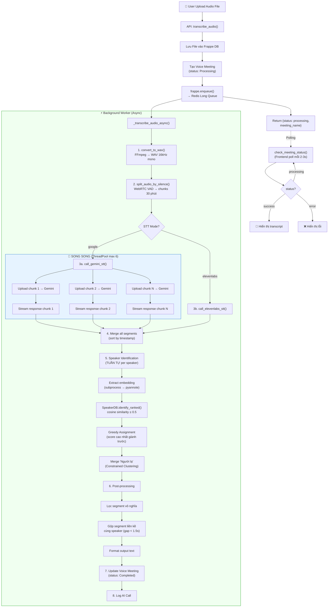

#### Chi tiết xử lý song song trong Gemini STT:

| Bước | Thực thi | Chi tiết |
|------|----------|---------|
| Upload file | **SONG SONG** nhưng có **Lock** | `_upload_lock` — mỗi lần chỉ 1 thread upload (tránh 429) + delay 1.5s |
| STT streaming | **SONG SONG** | `ThreadPoolExecutor(max_workers=6)` — tối đa 6 chunk song song |
| Wait file ACTIVE | **Tuần tự** per chunk | Poll mỗi 5s, tối đa 30 lần (150s) |
| Speaker ID | **Tuần tự** | Xử lý từng speaker một (embedding extraction là subprocess riêng) |

#### Cơ chế Smart Resume:
Khi Gemini gặp hallucination (MAX_TOKENS), hệ thống **tự động cắt phần chưa xử lý** và gọi lại:
```
Chunk bị ngáo ở giây 300/600s → Cắt audio [300s:600s] → Tạo sub-chunk → Gọi Gemini lại → Merge kết quả
```

---

### 3.2 🧹 LUỒNG 2: Clean Transcript (Làm sạch văn bản)

> **Loại:** **BẤT ĐỒNG BỘ** (frappe.enqueue → Redis Long Queue)  
> **Timeout:** 1500s  
> **Xử lý:** **TUẦN TỰ** (gọi OpenAI GPT → update DB)

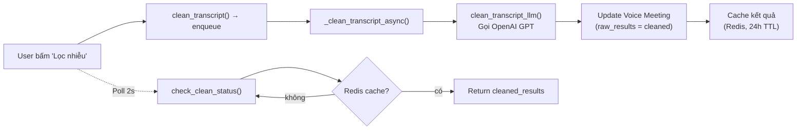

---

### 3.3 📝 LUỒNG 3: Extract Tasks (Trích xuất nhiệm vụ)

> **Loại:** **BẤT ĐỒNG BỘ** (frappe.enqueue → Redis Long Queue)  
> **Xử lý:** **TUẦN TỰ** nhưng dùng **LangGraph State Machine** (6 nodes)

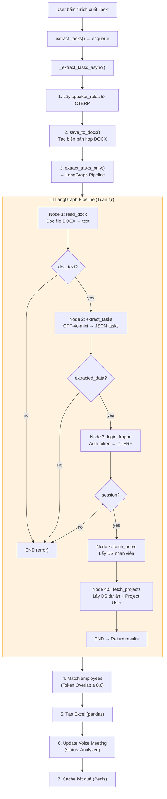

#### LangGraph State Flow:

| Node | Input | Output | Conditional |
|------|-------|--------|-------------|
| `read_docx` | file_path | doc_text | → `extract` nếu có text, → `END` nếu không |
| `extract_tasks` | doc_text | extracted_data (JSON) | → `login` nếu OK, → `END` nếu lỗi |
| `login_frappe` | — | session (requests.Session) | → `fetch_users` nếu auth OK |
| `fetch_users` | session | frappe_users list | Luôn → `fetch_projects` |
| `fetch_projects` | session | frappe_projects map | Luôn → `END` |

---

### 3.4 🎤 LUỒNG 4: Voice-to-Task (Tạo task bằng giọng nói)

> **Loại:** **ĐỒNG BỘ** (xử lý ngay, không enqueue)  
> **Xử lý:** **TUẦN TỰ** hoàn toàn

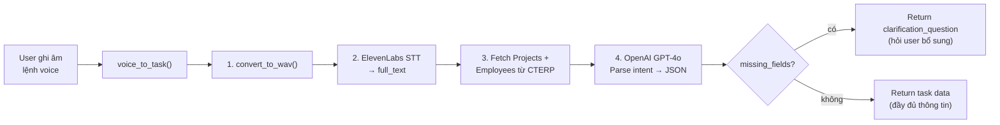

**Đặc điểm nổi bật:**
- Hỗ trợ **multi-turn**: gửi `existing_task` để bổ sung thông tin qua nhiều lần nói
- Tự động gán người thực hiện = người đang đăng nhập nếu user nói "tôi", "mình"
- Tính toán ngày thông minh: "ngày mai", "tuần sau", "vài ngày nữa"

---

### 3.5 🔊 LUỒNG 5: Voice Enrollment (Đăng ký giọng nói)

> **Loại:** **ĐỒNG BỘ**  
> **Xử lý:** **TUẦN TỰ**

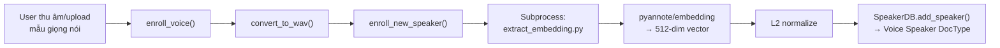

---

### 3.6 🔄 LUỒNG 6: Sync Tasks to ERP

> **Loại:** **ĐỒNG BỘ**  
> **Xử lý:** **TUẦN TỰ** với **Transactional Rollback**

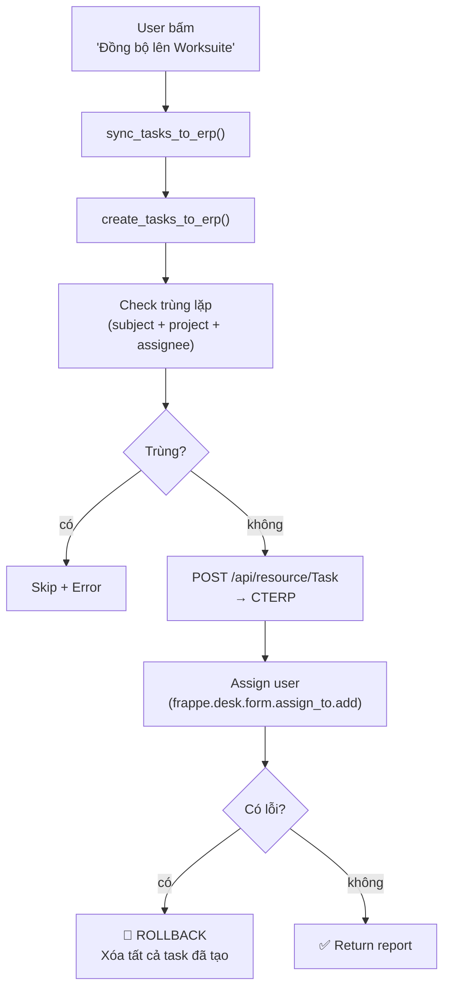

---

## IV. BẢN ĐỒ LUỒNG DỮ LIỆU TỔNG THỂ

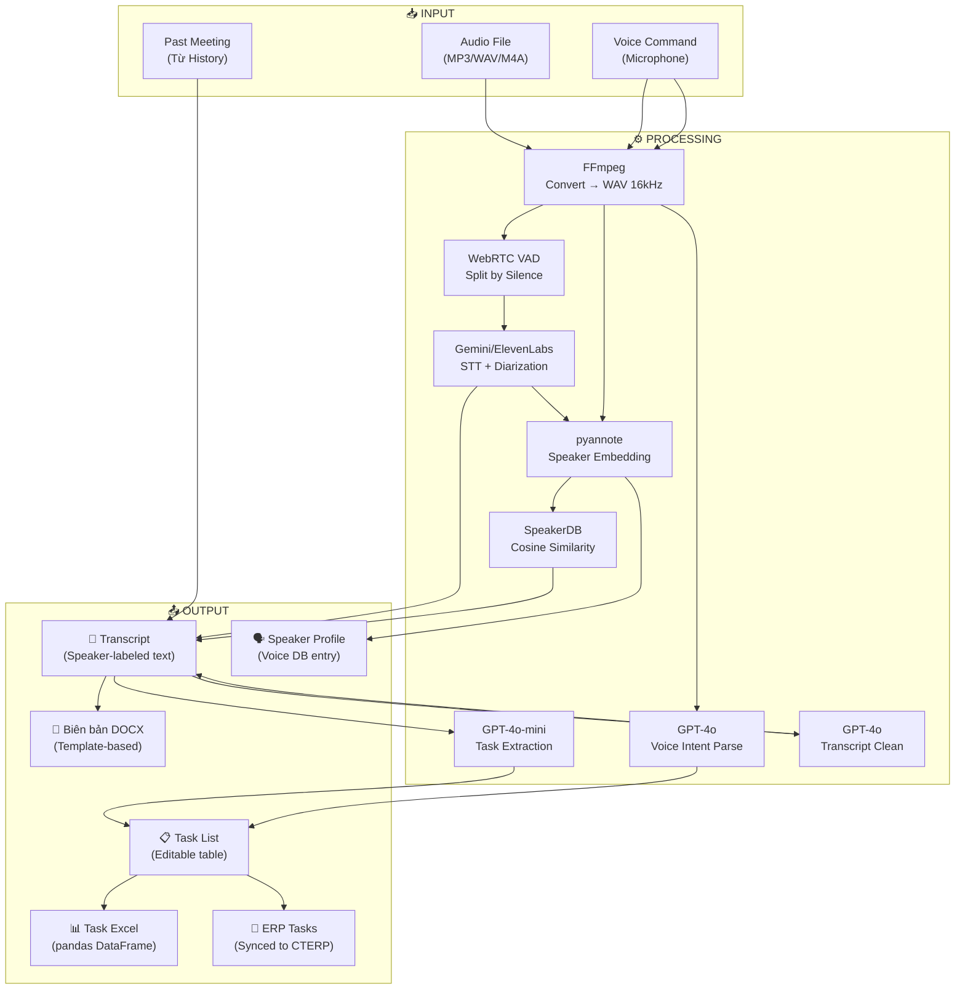

---

## V. TỔ CHỨC LUỒNG: TUẦN TỰ vs SONG SONG

### 5.1 Tổng quan

| Luồng | Kiểu thực thi | Async? | Song song nội bộ? |
|-------|--------------|--------|-------------------|
| **Transcribe Audio** | Async (Redis Queue) | ✅ | ✅ 6 threads (Gemini chunks) |
| **Clean Transcript** | Async (Redis Queue) | ✅ | ❌ Tuần tự |
| **Extract Tasks** | Async (Redis Queue) | ✅ | ❌ Tuần tự (LangGraph) |
| **Voice-to-Task** | Synchronous | ❌ | ❌ Tuần tự |
| **Voice Enrollment** | Synchronous | ❌ | ❌ Tuần tự |
| **Sync to ERP** | Synchronous | ❌ | ❌ Tuần tự |
| **Frontend Polling** | Async (setInterval) | ✅ | ❌ |

### 5.2 Chi tiết Song Song trong Transcribe

```
┌─────────────────────────────────────────────────────────────────┐
│                    TRANSCRIBE PIPELINE                          │
│                                                                 │
│  [TUẦN TỰ]  Upload audio → Convert WAV → Split chunks          │
│       │                                                         │
│       ▼                                                         │
│  [SONG SONG - ThreadPoolExecutor(6)]                            │
│  ┌──────────┐ ┌──────────┐ ┌──────────┐ ┌──────────┐          │
│  │ Chunk 0  │ │ Chunk 1  │ │ Chunk 2  │ │ Chunk N  │          │
│  │ Upload   │ │ Upload   │ │ Upload   │ │ Upload   │          │
│  │ (locked) │ │ (locked) │ │ (locked) │ │ (locked) │          │
│  │ Stream   │ │ Stream   │ │ Stream   │ │ Stream   │          │
│  │ Parse    │ │ Parse    │ │ Parse    │ │ Parse    │          │
│  └──────────┘ └──────────┘ └──────────┘ └──────────┘          │
│       │            │            │            │                  │
│       ▼            ▼            ▼            ▼                  │
│  [TUẦN TỰ]  Merge → Speaker ID → Greedy Assign → Format       │
│       │                                                         │
│       ▼                                                         │
│  [TUẦN TỰ]  Save to DB → Log                                   │
└─────────────────────────────────────────────────────────────────┘
```

### 5.3 Cơ Chế Polling (Frontend ↔ Backend)

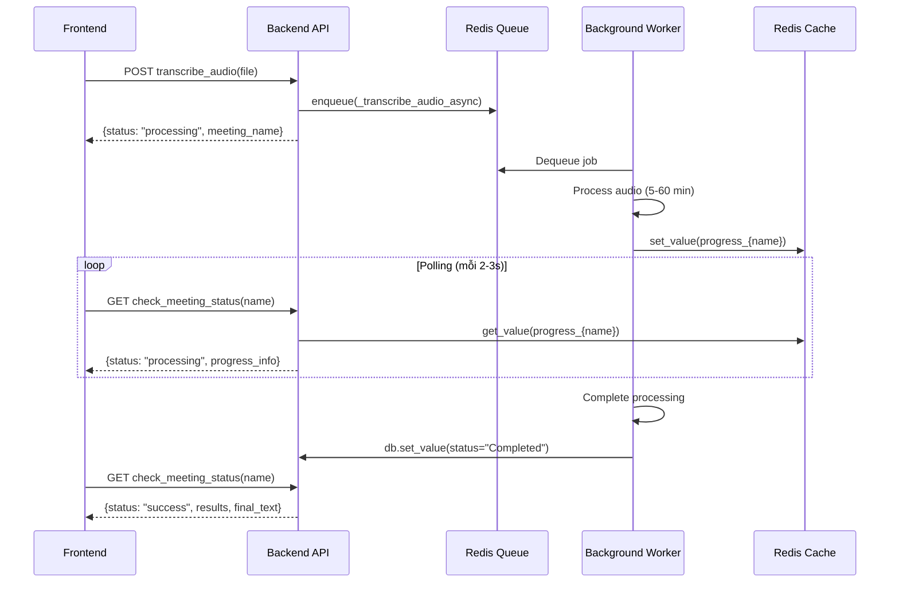

---

## VI. INTEGRATION MAP (Tích hợp bên ngoài)

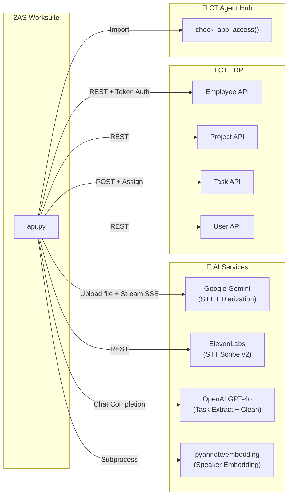

---

## VII. OBSERVABILITY & LOGGING

Hệ thống sử dụng **ActivityLogger** — một utility dùng chung cho tất cả Frappe App trong CT Group:

```
Session (1 lần mở app)
  ├── Action Log 1 (transcribe_audio)
  │     ├── AI Call Log (google/speech-to-text)
  │     └── AI Call Log (elevenlabs/scribe_v2)
  ├── Action Log 2 (extract_tasks)
  │     └── AI Call Log (gpt-4o-mini)
  ├── Action Log 3 (clean_transcript)
  │     └── AI Call Log (gpt-4o)
  └── Action Log 4 (voice_to_task)
        └── AI Call Log (gpt-4o)
```

**Metrics được track:**
- `prompt_tokens`, `completion_tokens` → Token usage per model
- `duration_seconds` → Thời gian xử lý
- `elevenlabs_chars_used/remaining` → ElevenLabs quota
- `token_breakdown` (JSON) → Breakdown theo từng model
- `total_ai_calls`, `total_actions` → Aggregated per session

---

## VIII. ERROR HANDLING & RESILIENCE

| Cơ chế | Áp dụng ở | Chi tiết |
|--------|-----------|---------|
| **Retry with Exponential Backoff** | Gemini STT | 4 lần retry, delay: 5→10→20→40s + jitter |
| **Smart Resume** | Gemini STT | Khi bị hallucination, cắt phần chưa xử lý → chạy tiếp |
| **Partial Error** | Transcribe | Nếu STT xong nhưng lỗi giữa chừng → lưu phần đã có |
| **Transactional Rollback** | Sync to ERP | Nếu 1 task lỗi → xóa tất cả task đã tạo |
| **Subprocess Isolation** | Speaker Embedding | PyTorch chạy trong subprocess riêng → tránh DNNL crash trong Gunicorn |
| **Upload Lock** | Gemini chunk upload | `threading.Lock()` — chỉ 1 thread upload cùng lúc (tránh 429) |
| **Embedding Cache** | Speaker Manager | FIFO cache 64 entries → tránh gọi subprocess trùng lặp |
| **DB Rollback Guards** | Logging | Nếu log AI call lỗi → rollback DB trước khi tiếp tục |

---

## IX. SƠ ĐỒ TRẠNG THÁI VOICE MEETING

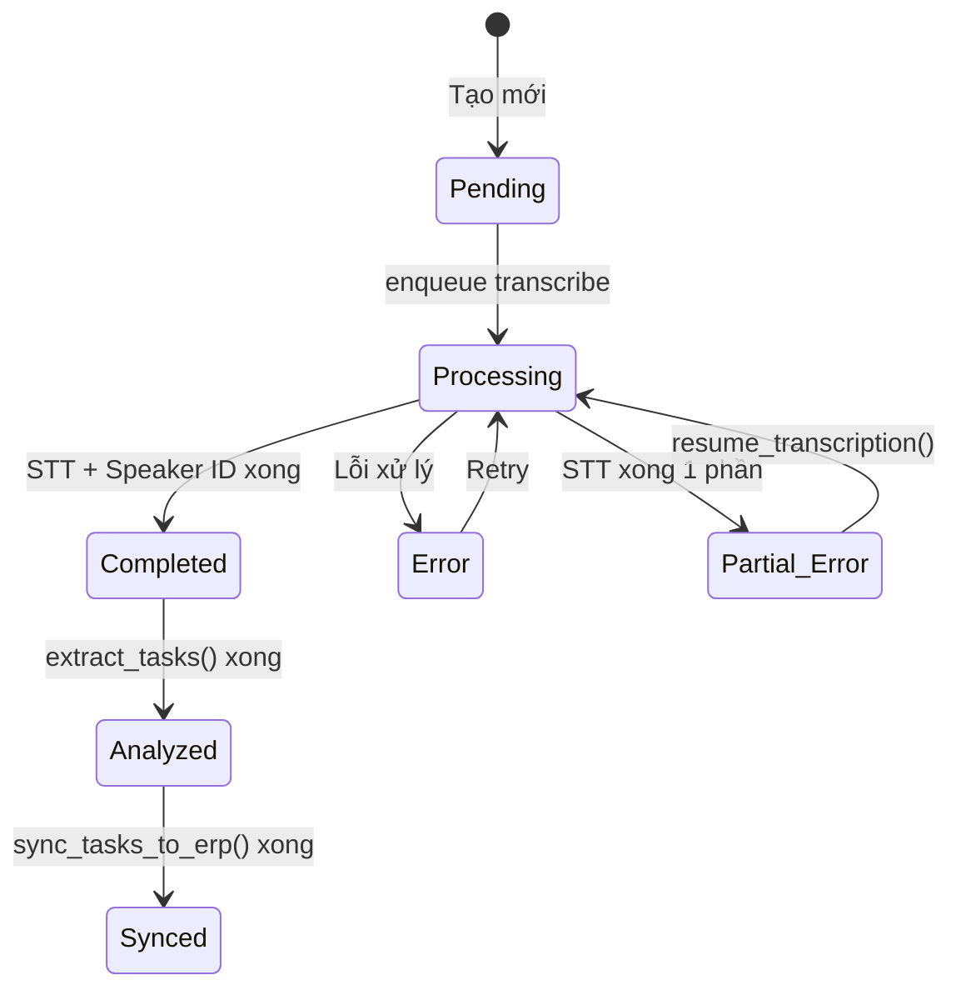

---

## X. FRONTEND ARCHITECTURE

### 10.1 Routing (SPA)

```
/aicenter/2as-worksuite → voice_app_spa (Frappe website_route_rules)
```

### 10.2 Views & Components

| View/Component | Chức năng |
|----------------|-----------|
| `VoiceTranscribe.vue` | Upload audio, hiển thị transcript, clean, extract tasks |
| `VoiceEnroll.vue` | Thu âm/upload mẫu giọng, đăng ký Speaker DB |
| `VoiceTask.vue` | Ghi âm lệnh voice → tạo task nhanh |
| `MeetingHistory.vue` | Xem lại lịch sử cuộc họp |
| `TaskModal.vue` | Modal chỉnh sửa task trước khi sync |
| `AppSidebar.vue` | Navigation sidebar |

### 10.3 State Management

Sử dụng **Vue 3 Composition API** với shared reactive state qua `useVoiceApp.js`:
- Không dùng Vuex/Pinia — state được export trực tiếp từ composable
- Polling status qua `setInterval` + API calls

---

## XI. TÓM TẮT SỐ LƯỢNG LUỒNG

| Metric | Giá trị |
|--------|---------|
| **Tổng số luồng chính** | **6 luồng** |
| **Luồng bất đồng bộ (Async)** | **3** (Transcribe, Clean, Extract) |
| **Luồng đồng bộ (Sync)** | **3** (Voice-to-Task, Enroll, Sync ERP) |
| **Luồng có xử lý song song bên trong** | **1** (Transcribe → 6 threads) |
| **Luồng hoàn toàn tuần tự** | **5** |
| **Tổng số External API tích hợp** | **5** (Gemini, ElevenLabs, OpenAI, CTERP, pyannote) |
| **Tổng số REST endpoints** | **~20** endpoints (`@frappe.whitelist`) |
| **Tổng số DocTypes** | **7** |

> [!IMPORTANT]
> Điểm mấu chốt: Hệ thống sử dụng mô hình **"Enqueue + Polling"** cho các tác vụ nặng (STT, Extract). Frontend liên tục poll backend qua REST API (mỗi 2-3s) để kiểm tra trạng thái. **Không sử dụng WebSocket** — toàn bộ giao tiếp real-time dựa trên polling + Redis cache.
